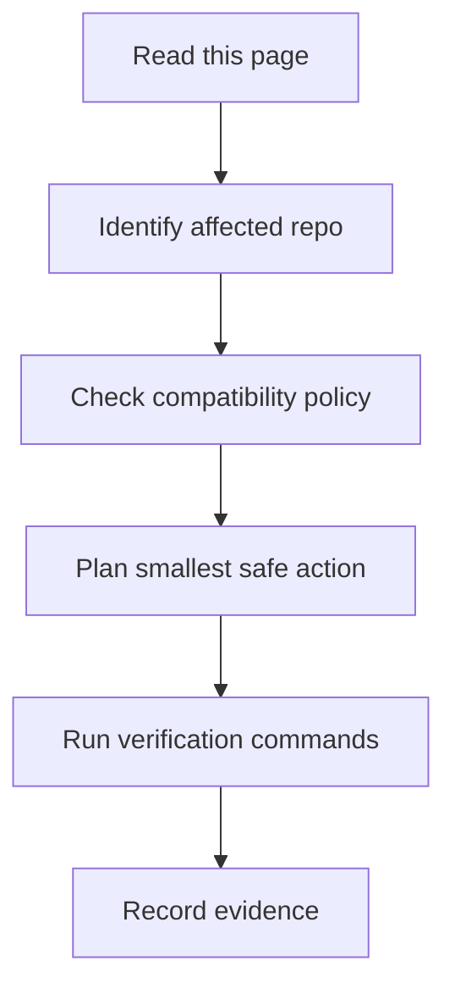

## What Is /goal

`/goal` is a Codex CLI mode for long-running, auditable work. Use it when the task spans multiple repos, requires inventory before edits, or needs a final completion audit.

## When To Use /goal

Use it for dependency modernization, security triage, build reproducibility, release readiness, repository mapping, or documentation site maintenance. Do not use it to hide uncertainty; the final answer must still show evidence.

## How To Break Down Large Maintenance Work

1. Inventory repos, branches, build files, tests, CI, and licenses.
2. Map the affected component and legacy compatibility contract.
3. Select the smallest safe edit.
4. Run narrow tests first, then broader checks.
5. Update docs, diagrams, search index, and release notes.
6. Audit every explicit requirement before declaring completion.

## Ask AI To Inventory Before Editing

A good prompt requires the agent to inspect current state, preserve dirty user work, and explain risk before touching code.

## Ask AI To Verify Every Step

Require exact commands and evidence. Passing a build is not enough unless it covers the requested behavior.

## Ask AI To Avoid One Large Rewrite

Tell the agent to split code changes by repo and ownership boundary, especially for Cattle, server, agent, and database work.

## Copyable /goal Prompts

### 1. 建立 repository map

```text
/goal
盤點目前工作區所有 rancher-1.6-* repo，找出 build files、測試、CI、license、upstream reference，更新 repository-map 與 dependency-map/index。
完成前請輸出 changed files、summary、tests run、tests not run、known risks、rollback、next steps，並且做 prompt-to-artifact completion audit。
```

### 2. 分析 dependency risk

```text
/goal
掃描 pom.xml、package.json、bower.json、go.mod、glide.yaml、Dockerfile，產生 risk matrix，但不要升級任何 dependency。
完成前請輸出 changed files、summary、tests run、tests not run、known risks、rollback、next steps，並且做 prompt-to-artifact completion audit。
```

### 3. 修復 build failure

```text
/goal
先重現 build failure，定位最小 repo/path，提出最小修補，保留完整錯誤與驗證指令。
完成前請輸出 changed files、summary、tests run、tests not run、known risks、rollback、next steps，並且做 prompt-to-artifact completion audit。
```

### 4. 升級單一 dependency

```text
/goal
只升級一個 dependency，先回答相容性、DB、Docker、agent 影響，再補測試與 rollback。
完成前請輸出 changed files、summary、tests run、tests not run、known risks、rollback、next steps，並且做 prompt-to-artifact completion audit。
```

### 5. 修補 CVE

```text
/goal
分析 CVE 是否可利用、受影響路徑、可替代修補方式與隔離部署建議。
完成前請輸出 changed files、summary、tests run、tests not run、known risks、rollback、next steps，並且做 prompt-to-artifact completion audit。
```

### 6. 建立 compatibility shim

```text
/goal
在不改變 legacy API 的前提下建立 shim，補充對照測試與 migration note。
完成前請輸出 changed files、summary、tests run、tests not run、known risks、rollback、next steps，並且做 prompt-to-artifact completion audit。
```

### 7. 補測試

```text
/goal
針對指定 bug 補最小 regression test，不重構無關程式碼。
完成前請輸出 changed files、summary、tests run、tests not run、known risks、rollback、next steps，並且做 prompt-to-artifact completion audit。
```

### 8. 產生 release checklist

```text
/goal
根據本次 changed files 產生 release checklist、artifact 清單與 rollback plan。
完成前請輸出 changed files、summary、tests run、tests not run、known risks、rollback、next steps，並且做 prompt-to-artifact completion audit。
```

### 9. 對照 upstream 行為

```text
/goal
比較 chen21019 fork 與 upstream Rancher 1.6 相關檔案差異，整理行為差異與風險。
完成前請輸出 changed files、summary、tests run、tests not run、known risks、rollback、next steps，並且做 prompt-to-artifact completion audit。
```

### 10. 重構但保持 API 相容

```text
/goal
先列出 public API、DB schema、Docker image、old agent compatibility，再分小 PR 重構。
完成前請輸出 changed files、summary、tests run、tests not run、known risks、rollback、next steps，並且做 prompt-to-artifact completion audit。
```

## AI Agent Contract

### 必須先讀
- `AGENTS.md`
- [Repository Map](/getting-started/repository-map/)
- [Risk Matrix](/dependency-map/risk-matrix/)

### 允許動作
- Inventory, scoped edits, tests, docs updates, and release notes.

### 禁止動作
- Broad formatting, hidden major upgrades, deleting tests, removing EOL disclaimers, or using unlicensed images.

### 必要檢查
- Git status, repo ownership, compatibility risk, verification, rollback.

### 驗證
```powershell
npm run verify
```

### 回滾
Revert only the agent's changes and preserve user work.

### 輸出格式
Changed files, summary, tests run, tests not run and why, known risks, next steps.

## 人類維護者檢查清單

- Use `/goal` only for work that needs inventory, scoped execution, and completion audit.
- Review the AI task summary before approving code changes.
- Require concrete evidence for every stated success criterion.

## AI Agent 檢查清單

- Inventory before editing and preserve user changes.
- Split risky work into small verifiable steps.
- Finish with changed files, tests, risks, rollback, and next steps.
## 圖表



圖名：Codex CLI Goal Guide 流程
用途：把 Codex CLI Goal Guide 轉成可執行的維護流程。
AI 用途：AI Agent 可依此拆解任務、驗證結果並回報。
維護注意：若流程、指令或禁止事項改變，必須同步更新此圖。

