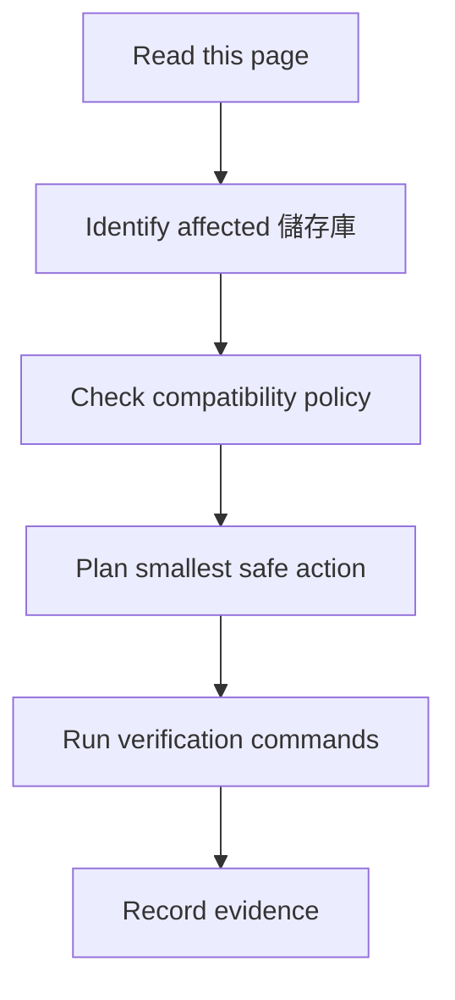

## /goal 是什麼

`/goal` 是 Codex CLI 用於長時間、可稽核工作的模式。當任務橫跨多個 儲存庫、編輯前需要盤點，或需要最終完成稽核時使用。

## 何時使用 /goal

可用於 dependency modernization、security triage、可重現建置、發版 readiness、儲存庫 mapping 或文件站維護。不可用它掩蓋不確定性；最終回答仍必須提供證據。

## 如何拆解大型維護任務

1. 盤點 儲存庫、branch、build files、tests、CI 與 licenses。
2. 映射受影響 component 與 舊版 compatibility contract。
3. 選擇最小安全修改。
4. 先跑窄範圍測試，再跑更廣的檢查。
5. 更新文件、圖表、搜尋索引與 發版 notes。
6. 宣告完成前稽核每一項明確需求。

## 要求 AI 編輯前先盤點

好的 prompt 會要求 agent 先檢查目前狀態、保留使用者未提交工作，並在碰 code 前說明風險。

## 要求 AI 驗證每一步

要求精確指令與證據。除非 build 覆蓋了需求行為，否則 build pass 不等於完成。

## 要求 AI 避免一次大型重寫

要求 agent 依 儲存庫 與 ownership boundary 拆分 code change，尤其是 Cattle、server、agent 與 database 相關工作。

## 可複製的 /goal Prompt

### 1. 建立 儲存庫 map

```text
/goal
盤點目前工作區所有 rancher-1.6-* 儲存庫，找出 build files、測試、CI、license、upstream reference，更新 儲存庫-map 與 dependency-map/index。
完成前請輸出 changed files、summary、tests run、tests not run、known risks、回復方案、next steps，並且做 prompt-to-artifact completion audit。
```

### 2. 分析 dependency risk

```text
/goal
掃描 pom.xml、package.json、bower.json、go.mod、glide.yaml、Dockerfile，產生 risk matrix，但不要升級任何 dependency。
完成前請輸出 changed files、summary、tests run、tests not run、known risks、回復方案、next steps，並且做 prompt-to-artifact completion audit。
```

### 3. 修復 build failure

```text
/goal
先重現 build failure，定位最小 儲存庫/path，提出最小修補，保留完整錯誤與驗證指令。
完成前請輸出 changed files、summary、tests run、tests not run、known risks、回復方案、next steps，並且做 prompt-to-artifact completion audit。
```

### 4. 升級單一 dependency

```text
/goal
只升級一個 dependency，先回答相容性、DB、Docker、agent 影響，再補測試與回復方案。
完成前請輸出 changed files、summary、tests run、tests not run、known risks、回復方案、next steps，並且做 prompt-to-artifact completion audit。
```

### 5. 修補 CVE

```text
/goal
分析 CVE 是否可利用、受影響路徑、可替代修補方式與隔離部署建議。
完成前請輸出 changed files、summary、tests run、tests not run、known risks、回復方案、next steps，並且做 prompt-to-artifact completion audit。
```

### 6. 建立 compatibility shim

```text
/goal
在不改變 舊版 API 的前提下建立 shim，補充對照測試與 migration note。
完成前請輸出 changed files、summary、tests run、tests not run、known risks、回復方案、next steps，並且做 prompt-to-artifact completion audit。
```

### 7. 補測試

```text
/goal
針對指定 bug 補最小 regression test，不重構無關程式碼。
完成前請輸出 changed files、summary、tests run、tests not run、known risks、回復方案、next steps，並且做 prompt-to-artifact completion audit。
```

### 8. 產生 發版 checklist

```text
/goal
根據本次 changed files 產生 發版 checklist、artifact 清單與回復方案 plan。
完成前請輸出 changed files、summary、tests run、tests not run、known risks、回復方案、next steps，並且做 prompt-to-artifact completion audit。
```

### 9. 對照 upstream 行為

```text
/goal
比較 chen21019 fork 與 upstream Rancher 1.6 相關檔案差異，整理行為差異與風險。
完成前請輸出 changed files、summary、tests run、tests not run、known risks、回復方案、next steps，並且做 prompt-to-artifact completion audit。
```

### 10. 重構但保持 API 相容

```text
/goal
先列出 public API、DB schema、Docker image、old agent compatibility，再分小 PR 重構。
完成前請輸出 changed files、summary、tests run、tests not run、known risks、回復方案、next steps，並且做 prompt-to-artifact completion audit。
```

## AI Agent 作業契約

### 必須先讀
- `AGENTS.md`
- [儲存庫地圖](/getting-started/repository-map/)
- [風險矩陣](/dependency-map/risk-matrix/)

### 允許動作
- 盤點、範圍化修改、測試、文件更新與 發版 notes。

### 禁止動作
- 大範圍格式化、隱藏 major upgrade、刪除測試、移除已查證的風險說明 或使用未授權圖片。

### 必要檢查
- Git status、儲存庫 ownership、compatibility risk、verification 與回復方案。

### 驗證
```powershell
npm run verify
```

### 回滾
只回滾 agent 自己的變更，並保留使用者工作。

### 輸出格式
變更檔案、摘要、已執行測試、未執行測試與原因、已知風險、下一步。

## 人類維護者檢查清單

- 只在需要盤點、範圍化執行與完成稽核的工作使用 `/goal`。
- 核准 code change 前，先審查 AI 任務摘要。
- 每一項成功條件都必須有具體證據。

## AI Agent 檢查清單

- 編輯前先盤點，並保留使用者變更。
- 把高風險工作拆成可驗證的小步驟。
- 最後回報變更檔案、測試、風險、回復方案 與下一步。
## 圖表



圖名：Codex CLI Goal Guide 流程
用途：把 Codex CLI Goal Guide 轉成可執行的維護流程。
AI 用途：AI Agent 可依此拆解任務、驗證結果並回報。
維護注意：若流程、指令或禁止事項改變，必須同步更新此圖。
