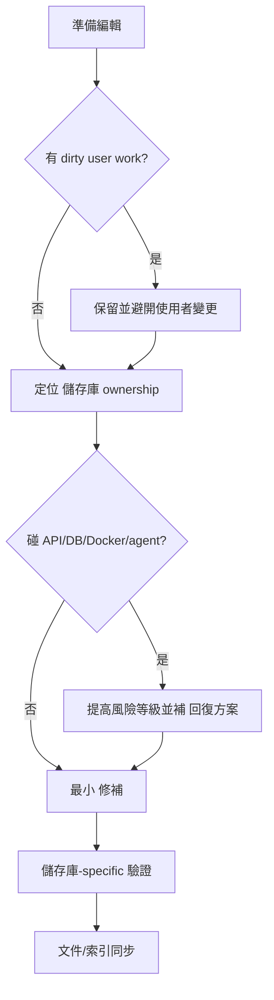

## 核心原則

Rancher 1.6 的安全與相容性狀態必須以 儲存庫/path、版本、來源與測試證據查證；安全編輯的目標是留下可回溯證據，而不是補上未查證結論。

## 編輯前必須回答

| 問題 | 為什麼重要 |
| --- | --- |
| 哪些 `rancher-1.6-*` 儲存庫 受影響？ | server、agent、metadata、DNS、net、catalog 可能共享行為契約。 |
| 是否碰到 API、DB schema、Docker image、old agent compatibility？ | 這些都是 舊版 operator 最容易被破壞的面。 |
| 變更是 pin、shim、修補 還是 major upgrade？ | major upgrade 必須走 migration 設計，不可混在 bug fix。 |
| 最小驗證指令是什麼？ | 沒有驗證就不可宣稱完成。 |
| 回復方案 會不會涉及 DB 或 image 狀態？ | 有些變更不能只靠 revert 程式碼還原。 |

## 允許的修改

- 小範圍 bug fix、compatibility shim、文件補強、搜尋索引更新。
- 單一依賴的可驗證 修補，且有風險矩陣條目與回復方案。
- 新增 regression test 或把既有測試指令文件化。

## 人類維護者檢查清單

- 檢查 AI 是否回答 API、DB、Docker image、old agent compatibility 影響。
- 檢查 changed files 是否符合任務範圍。
- 合併前要求 儲存庫-specific 驗證或明確未驗證原因。

## AI Agent 檢查清單

- 編輯前確認 dirty worktree。
- 修改前定位 儲存庫 ownership。
- 修改後同步文件、圖表與搜尋索引。

## 禁止的修改

- 刪除測試、降低安全檢查、移除已查證的風險說明。
- 同時升級多個 high-risk dependency。
- 無證據地改 Docker base image、Windows nanoserver tag、agent-base tag。
- 大規模格式化 Java/Go/JS 檔案。
- 把 `rancher-1.6-cattle` 的 API 或 DB 行為改成只符合現代框架預設。

## 驗證梯度

```powershell
git status --short
rg -n "dependency|Dockerfile|pom.xml|Godeps|bower|agent|metadata|dns|catalog" docs-site/src/content/docs
npm run verify
```

Repo-specific 驗證必須依實際修改補上，例如 `Makefile`、Maven module test、Go package test、Docker build 或 catalog template fixture。

## 圖表



圖名：安全編輯決策
用途：避免 AI 直接動 舊版 高風險區域。
AI 用途：每次 修補 前逐項檢查。
維護注意：如果新增驗證工具，請同步更新驗證梯度。
