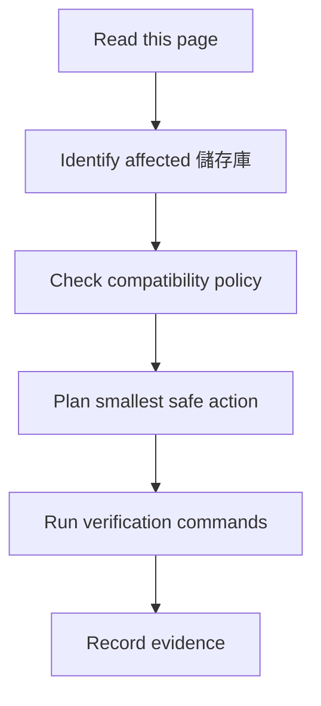

## 適用讀者
本頁服務需要實用起點的人類維護者，以及需要明確安全邊界的 AI Agent。

## 目的
Project model 與相容性注意事項。相關 儲存庫、依賴或工作流程改變時，必須同步更新本頁。

## 人類維護者檢查清單
- 確認受影響的 Rancher 1.6 儲存庫 與 branch。
- 對照 舊版 行為與 API 相容性。
- 保留明確的 build、test、Docker 與 database 驗證證據。
- 若有使用者可見行為變更，必須更新 發版 notes。

## AI Agent 檢查清單
- 編輯前先閱讀 `AGENTS.md`。
- 先產出包含範圍、風險、驗證與回復方案 的任務摘要。
- 優先採用最小 修補，避免無關格式化變更。
- 保留已查證的風險說明。

## 驗證指令
```powershell
git status --short
npm run validate:frontmatter
npm run search:smoke
npm run build
```

## 風險
- Rancher 1.6 的風險狀態必須以實際依賴、image、CVE 與官方來源查證後記錄。
- 現代 Java、Go、Node、Docker 與資料庫行為可能破壞舊版假設。
- 必須保留 server、agent、metadata、DNS、catalog 與 UI 相容性。

## 下一步閱讀
- [儲存庫地圖](/getting-started/repository-map/)
- [風險矩陣](/dependency-map/risk-matrix/)
- [安全編輯規則](/ai-guide/safe-editing-rules/)

## AI Agent 作業契約

### 必須先讀
- `README.md`
- `AGENTS.md`
- `docs-site/src/content/docs/ai-guide/index.md`
- `docs-site/src/content/docs/getting-started/repository-map.md`
- `docs-site/src/content/docs/dependency-map/risk-matrix.md`

### 允許動作
- 檢查檔案與 build metadata。
- 提出小範圍修改。
- 更新文件、圖表與驗證證據。

### 禁止動作
- 不可移除已查證的 security note。
- 不可進行大規模格式化 churn。
- 沒有明確相容性計畫時，不可更動 major dependencies。
- 不可為了讓 build 通過而刪除測試。

### 必要檢查
- 編輯前檢查 git status。
- 識別受影響 儲存庫 與 舊版 相容性範圍。
- 執行最窄且相關的驗證指令。

### 驗證
依實際 儲存庫 修改補上 儲存庫-specific 指令；下方指令只驗證文件站與索引。

### 回滾
只回滾自己的變更，保留使用者工作，並記錄需要 回復方案 的原因。

### 輸出格式
回報 changed files、summary、tests run、tests not run and why、known risks 與 next steps。


## 圖表



圖名：專案 API 流程
用途：把 專案 API 轉成可執行的維護流程。
AI 用途：AI Agent 可依此拆解任務、驗證結果並回報。
維護注意：若流程、指令或禁止事項改變，必須同步更新此圖。
