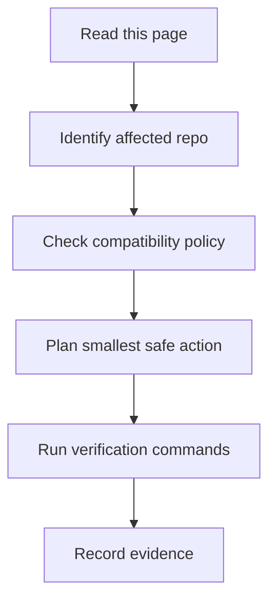

## 適用讀者
本頁服務需要實用起點的人類維護者，以及需要明確安全邊界的 AI Agent。

## 目的
Test pyramid and targeted regression policy. 相關 repository、依賴或工作流程改變時，必須同步更新本頁。

## 人類維護者檢查清單
- 確認受影響的 Rancher 1.6 repository 與 branch。
- 對照 legacy 行為與 API 相容性。
- 保留明確的 build、test、Docker 與 database 驗證證據。
- 若有使用者可見行為變更，必須更新 release notes。

## AI Agent 檢查清單
- 編輯前先閱讀 `AGENTS.md`。
- 先產出包含範圍、風險、驗證與 rollback 的任務摘要。
- 優先採用最小 patch，避免無關格式化變更。
- 保留 EOL 與 production 風險警告。

## 驗證指令佔位
```powershell
git status --short
npm run validate:frontmatter
npm run search:smoke
npm run build
```

## 風險
- Rancher 1.6 屬於 legacy/EOL，可能仍有未修補 CVE。
- 現代 Java、Go、Node、Docker 與資料庫行為可能破壞舊版假設。
- 必須保留 server、agent、metadata、DNS、catalog 與 UI 相容性。

## 下一步閱讀
- [Repository Map](/getting-started/repository-map/)
- [Risk Matrix](/dependency-map/risk-matrix/)
- [Safe Editing Rules](/ai-guide/safe-editing-rules/)

## AI Agent Contract

### 必須先讀
- `README.md`
- `AGENTS.md`
- `docs-site/src/content/docs/ai-guide/index.md`
- `docs-site/src/content/docs/getting-started/repository-map.md`
- `docs-site/src/content/docs/dependency-map/risk-matrix.md`

### 允許動作
- 檢查檔案與 build metadata。
- 提出小範圍修改。
- 更新文件、圖表與驗證證據。

### 禁止動作
- 不可移除 EOL / security disclaimer。
- 不可進行大規模格式化 churn。
- 沒有明確相容性計畫時，不可更動 major dependencies。
- 不可為了讓 build 通過而刪除測試。

### 必要檢查
- 編輯前檢查 git status。
- 識別受影響 repo 與 legacy 相容性範圍。
- 執行最窄且相關的驗證指令。

### 驗證
在 repo-specific 指令被驗證前，先使用下方指令作為佔位。

### 回滾
只回滾自己的變更，保留使用者工作，並記錄需要 rollback 的原因。

### 輸出格式
回報 changed files、summary、tests run、tests not run and why、known risks 與 next steps。


## 圖表



圖名：Test Strategy 流程
用途：把 Test Strategy 轉成可執行的維護流程。
AI 用途：AI Agent 可依此拆解任務、驗證結果並回報。
維護注意：若流程、指令或禁止事項改變，必須同步更新此圖。

