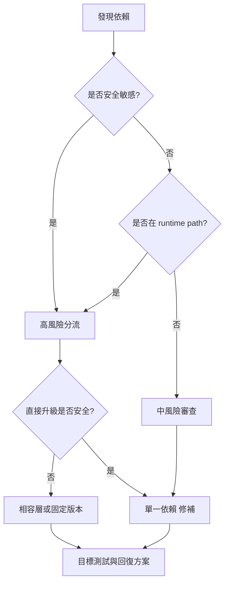

## 摘要

這是依據本機 `rancher-1.6-*` 工作區產生的第一版依賴風險矩陣。最新可用版本必須由維護者對照官方 registry 或 upstream 發版 page 查證；未查證欄位不可當作升級建議。

## 風險規則

- **高**：安全敏感、面向 runtime、涉及 auth/network/database、Docker base image、Bower 時代 UI，或已知老舊 framework family。
- **中**：build-time 或 library dependency，但仍可能影響相容性。
- **低**：只有在維護者證明它已隔離且有測試覆蓋後，才可標為低風險。

## 依賴矩陣

| 名稱 | 生態系 | Repo / 路徑 | 目前版本 | 最新可用版本 | 風險 | 安全敏感 | 直接升級 | 相容層 | 驗證 |
| --- | --- | --- | --- | --- | --- | --- | --- | --- | --- |
| ubuntu | docker | rancher-1.6-agent / package/Dockerfile | 26.04 | 未查證，需以官方 registry 確認 | 高 | 待審查 | 否 | 可能需要 | 目標建置 + 回歸測試 |
| io.cattle:cattle-framework-utils | maven | rancher-1.6-cattle / code/framework/api/pom.xml | 由 dependencyManagement 管理 | 未查證，需以官方 registry 確認 | 中 | 待審查 | 否 | 可能需要 | 目標建置 + 回歸測試 |
| io.cattle:cattle-framework-object | maven | rancher-1.6-cattle / code/framework/api/pom.xml | 由 dependencyManagement 管理 | 未查證，需以官方 registry 確認 | 中 | 待審查 | 否 | 可能需要 | 目標建置 + 回歸測試 |
| io.cattle:cattle-framework-metrics | maven | rancher-1.6-cattle / code/framework/api/pom.xml | 由 dependencyManagement 管理 | 未查證，需以官方 registry 確認 | 中 | 待審查 | 否 | 可能需要 | 目標建置 + 回歸測試 |
| io.cattle:cattle-framework-events | maven | rancher-1.6-cattle / code/framework/api/pom.xml | 由 dependencyManagement 管理 | 未查證，需以官方 registry 確認 | 中 | 待審查 | 否 | 可能需要 | 目標建置 + 回歸測試 |
| org.apache.commons:commons-beanutils2 | maven | rancher-1.6-cattle / code/framework/api/pom.xml | 由 dependencyManagement 管理 | 未查證，需以官方 registry 確認 | 高 | 待審查 | 否 | 可能需要 | 目標建置 + 回歸測試 |
| org.apache.commons:commons-collections4 | maven | rancher-1.6-cattle / code/framework/api/pom.xml | 由 dependencyManagement 管理 | 未查證，需以官方 registry 確認 | 高 | 待審查 | 否 | 可能需要 | 目標建置 + 回歸測試 |
| io.cattle:cattle-framework-spring-module | maven | rancher-1.6-cattle / code/framework/api/pom.xml | 由 dependencyManagement 管理 | 未查證，需以官方 registry 確認 | 高 | 是 | 否 | 可能需要 | 目標建置 + 回歸測試 |
| jakarta.servlet:jakarta.servlet-api | maven | rancher-1.6-cattle / code/framework/api/pom.xml | 由 dependencyManagement 管理 | 未查證，需以官方 registry 確認 | 中 | 待審查 | 否 | 可能需要 | 目標建置 + 回歸測試 |
| io.cattle:cattle-framework-jooq | maven | rancher-1.6-cattle / code/framework/api/pom.xml | 由 dependencyManagement 管理 | 未查證，需以官方 registry 確認 | 高 | 待審查 | 否 | 可能需要 | 目標建置 + 回歸測試 |
| io.cattle:cattle-framework-api | maven | rancher-1.6-cattle / code/framework/api-pub-sub/pom.xml | 由 dependencyManagement 管理 | 未查證，需以官方 registry 確認 | 中 | 待審查 | 否 | 可能需要 | 目標建置 + 回歸測試 |
| io.cattle:cattle-iaas-events | maven | rancher-1.6-cattle / code/framework/api-pub-sub/pom.xml | 由 dependencyManagement 管理 | 未查證，需以官方 registry 確認 | 中 | 待審查 | 否 | 可能需要 | 目標建置 + 回歸測試 |
| org.apache.geronimo.specs:geronimo-servlet_3.0_spec | maven | rancher-1.6-cattle / code/framework/api-pub-sub/pom.xml | 由 dependencyManagement 管理 | 未查證，需以官方 registry 確認 | 中 | 待審查 | 否 | 可能需要 | 目標建置 + 回歸測試 |
| io.cattle:cattle-framework-api-pub-sub | maven | rancher-1.6-cattle / code/framework/api-pub-sub-jetty/pom.xml | 由 dependencyManagement 管理 | 未查證，需以官方 registry 確認 | 中 | 待審查 | 否 | 可能需要 | 目標建置 + 回歸測試 |
| org.eclipse.jetty.ee10.websocket:jetty-ee10-websocket-jetty-server | maven | rancher-1.6-cattle / code/framework/api-pub-sub-jetty/pom.xml | 由 dependencyManagement 管理 | 未查證，需以官方 registry 確認 | 高 | 是 | 否 | 可能需要 | 目標建置 + 回歸測試 |
| jakarta.servlet:jakarta.servlet-api | maven | rancher-1.6-cattle / code/framework/api-pub-sub-jetty/pom.xml | 由 dependencyManagement 管理 | 未查證，需以官方 registry 確認 | 中 | 待審查 | 否 | 可能需要 | 目標建置 + 回歸測試 |
| com.netflix.archaius:archaius-core | maven | rancher-1.6-cattle / code/framework/archaius/pom.xml | 由 dependencyManagement 管理 | 未查證，需以官方 registry 確認 | 中 | 是 | 否 | 可能需要 | 目標建置 + 回歸測試 |
| com.google.guava:guava | maven | rancher-1.6-cattle / code/framework/async/pom.xml | 由 dependencyManagement 管理 | 未查證，需以官方 registry 確認 | 中 | 待審查 | 否 | 可能需要 | 目標建置 + 回歸測試 |
| io.cattle:cattle-framework-utils | maven | rancher-1.6-cattle / code/framework/async/pom.xml | 由 dependencyManagement 管理 | 未查證，需以官方 registry 確認 | 中 | 待審查 | 否 | 可能需要 | 目標建置 + 回歸測試 |
| io.cattle:cattle-framework-managed-context | maven | rancher-1.6-cattle / code/framework/async/pom.xml | 由 dependencyManagement 管理 | 未查證，需以官方 registry 確認 | 中 | 待審查 | 否 | 可能需要 | 目標建置 + 回歸測試 |
| io.cattle:cattle-framework-jooq | maven | rancher-1.6-cattle / code/framework/auditing/pom.xml | 由 dependencyManagement 管理 | 未查證，需以官方 registry 確認 | 高 | 待審查 | 否 | 可能需要 | 目標建置 + 回歸測試 |
| tianon/true | docker | rancher-1.6-compose-executor / tests/integration/cattletest/core/assets/build/subdir/Dockerfile | 未固定 latest tag | 未查證，需以官方 registry 確認 | 高 | 待審查 | 否 | 可能需要 | 目標建置 + 回歸測試 |
| ubuntu | docker | rancher-1.6-healthcheck / package/Dockerfile | 26.04 | 未查證，需以官方 registry 確認 | 高 | 待審查 | 否 | 可能需要 | 目標建置 + 回歸測試 |
| ubuntu | docker | rancher-1.6-lb-controller / package/haproxy/Dockerfile | 26.04 | 未查證，需以官方 registry 確認 | 高 | 待審查 | 否 | 可能需要 | 目標建置 + 回歸測試 |
| ubuntu | docker | rancher-1.6-lb-controller / package/haproxy/Dockerfile | 26.04 | 未查證，需以官方 registry 確認 | 高 | 待審查 | 否 | 可能需要 | 目標建置 + 回歸測試 |
| rancher/agent-base | docker | rancher-1.6-lb-controller / package/rancher/Dockerfile | v0.3.0 | 未查證，需以官方 registry 確認 | 高 | 待審查 | 否 | 可能需要 | 目標建置 + 回歸測試 |
| ubuntu | docker | rancher-1.6-plugin-manager / package/Dockerfile | 26.04 | 未查證，需以官方 registry 確認 | 高 | 待審查 | 否 | 可能需要 | 目標建置 + 回歸測試 |
| ghcr.io/chen21019/rc16-agent-base | docker | rancher-1.6-rancher / agent/Dockerfile | v0.3.1 | 未查證，需以官方 registry 確認 | 高 | 待審查 | 否 | 可能需要 | 目標建置 + 回歸測試 |
| ubuntu | docker | rancher-1.6-rancher / agent-base/Dockerfile | 26.04 | 未查證，需以官方 registry 確認 | 高 | 待審查 | 否 | 可能需要 | 目標建置 + 回歸測試 |
| ubuntu | docker | rancher-1.6-rancher / agent-base/Dockerfile | 26.04 | 未查證，需以官方 registry 確認 | 高 | 待審查 | 否 | 可能需要 | 目標建置 + 回歸測試 |
| microsoft/nanoserver | docker | rancher-1.6-rancher / agent-windows/Dockerfile | 10.0.14393.1593 | 未查證，需以官方 registry 確認 | 高 | 待審查 | 否 | 可能需要 | 目標建置 + 回歸測試 |
| ubuntu | docker | rancher-1.6-rancher / Dockerfile | 26.04 | 未查證，需以官方 registry 確認 | 高 | 待審查 | 否 | 可能需要 | 目標建置 + 回歸測試 |
| ubuntu | docker | rancher-1.6-rancher / server/Dockerfile | 26.04 | 未查證，需以官方 registry 確認 | 高 | 待審查 | 否 | 可能需要 | 目標建置 + 回歸測試 |
| rancher/dind | docker | rancher-1.6-rancher-catalog / Dockerfile | v0.6.0 | 未查證，需以官方 registry 確認 | 高 | 待審查 | 否 | 可能需要 | 目標建置 + 回歸測試 |
| ubuntu | docker | rancher-1.6-rancher-dns / package/linux/amd64/Dockerfile | 26.04 | 未查證，需以官方 registry 確認 | 高 | 待審查 | 否 | 可能需要 | 目標建置 + 回歸測試 |
| microsoft/nanoserver | docker | rancher-1.6-rancher-dns / package/windows/amd64/Dockerfile | 未固定 latest tag | 未查證，需以官方 registry 確認 | 高 | 待審查 | 否 | 可能需要 | 目標建置 + 回歸測試 |
| ubuntu | docker | rancher-1.6-rancher-metadata / package/Dockerfile | 26.04 | 未查證，需以官方 registry 確認 | 高 | 待審查 | 否 | 可能需要 | 目標建置 + 回歸測試 |
| ubuntu | docker | rancher-1.6-rancher-net / package/Dockerfile | 26.04 | 未查證，需以官方 registry 確認 | 高 | 待審查 | 否 | 可能需要 | 目標建置 + 回歸測試 |
| ubuntu | docker | rancher-1.6-scheduler / package/Dockerfile | 26.04 | 未查證，需以官方 registry 確認 | 高 | 待審查 | 否 | 可能需要 | 目標建置 + 回歸測試 |
| ubuntu | docker | rancher-1.6-storage / package/abs/Dockerfile | 26.04 | 未查證，需以官方 registry 確認 | 高 | 待審查 | 否 | 可能需要 | 目標建置 + 回歸測試 |
| ubuntu | docker | rancher-1.6-storage / package/ebs/Dockerfile | 26.04 | 未查證，需以官方 registry 確認 | 高 | 待審查 | 否 | 可能需要 | 目標建置 + 回歸測試 |
| ubuntu | docker | rancher-1.6-storage / package/efs/Dockerfile | 26.04 | 未查證，需以官方 registry 確認 | 高 | 待審查 | 否 | 可能需要 | 目標建置 + 回歸測試 |
| ubuntu | docker | rancher-1.6-storage / package/example/Dockerfile | 16.04 | 未查證，需以官方 registry 確認 | 高 | 待審查 | 否 | 可能需要 | 目標建置 + 回歸測試 |
| ubuntu | docker | rancher-1.6-storage / package/longhorn/Dockerfile | 16.04 | 未查證，需以官方 registry 確認 | 高 | 待審查 | 否 | 可能需要 | 目標建置 + 回歸測試 |
| ubuntu | docker | rancher-1.6-storage / package/nfs/Dockerfile | 26.04 | 未查證，需以官方 registry 確認 | 高 | 待審查 | 否 | 可能需要 | 目標建置 + 回歸測試 |
| ceph/base | docker | rancher-1.6-storage / package/rbd/Dockerfile | tag-build-master-jewel-ubuntu-16.04 | 未查證，需以官方 registry 確認 | 高 | 待審查 | 否 | 可能需要 | 目標建置 + 回歸測試 |
| ubuntu | docker | rancher-1.6-storage / package/secrets/Dockerfile | 16.04 | 未查證，需以官方 registry 確認 | 高 | 待審查 | 否 | 可能需要 | 目標建置 + 回歸測試 |
| ubuntu | docker | rancher-1.6-storage / package/secrets-bridge-v2/Dockerfile | 16.04 | 未查證，需以官方 registry 確認 | 高 | 待審查 | 否 | 可能需要 | 目標建置 + 回歸測試 |

## 人類維護者檢查清單

- 從 Maven Central、npm、Go module proxy、Docker Hub 或官方 upstream 發版 page 驗證每個未確認的最新版本。
- 除非是專用 migration branch，否則不可在同一個 修補 升級多個高風險依賴。
- server、agent、database 與 Docker image 變更都必須提供 回復方案 證據。

## AI Agent 檢查清單

- 將此矩陣視為盤點資料，不是升級許可。
- 編輯前必須先回答是否會影響 API compatibility、DB schema、Docker image、old agents 或 catalog behavior。
- 更新任何依賴項目時，必須在旁邊補上驗證證據。

## 驗證指令

```powershell
rg --files ..\rancher-1.6-* -g pom.xml -g package.json -g bower.json -g go.mod -g glide.yaml -g Dockerfile
npm run search:smoke
```

## 風險

依賴是否有漏洞、是否可直接升級，都必須以實際版本、官方來源與相容性測試查證；未查證前不可寫成結論。

## 下一步閱讀

- [依賴升級處理手冊](/runbooks/dependency-upgrade/)
- [風險查證記錄](/security/verified-risk-notes/)
- [修補工作流程](/maintenance/patch-workflow/)

## 圖表



圖名：Dependency upgrade 決策樹
用途：避免把所有老 dependency 都視為可直接升級。
AI 用途：AI Agent 必須先判定風險與相容層，再提出修改。
維護注意：風險規則改變時，要同步更新此圖與表格欄位。
