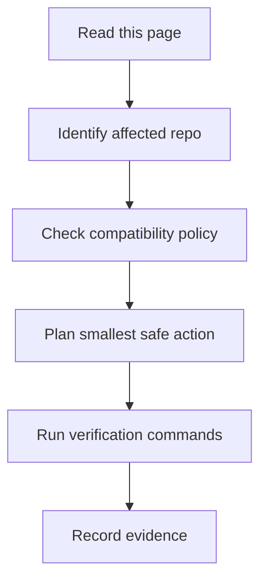

## Intended Audience
This page serves human maintainers who need a practical starting point and AI agents that need explicit safety boundaries.

## Purpose
Environment/project request behavior. It should be updated whenever the related repository, dependency, or workflow changes.

## Human Maintainer Checklist
- Confirm the affected Rancher 1.6 repository and branch.
- Compare the change against legacy behavior and API compatibility.
- Capture exact build, test, Docker, and database evidence.
- Update release notes when user-visible behavior changes.

## AI Agent Checklist
- Read `AGENTS.md` before editing.
- Produce a task summary with scope, risk, verification, and rollback.
- Prefer the smallest patch and avoid unrelated formatting changes.
- Keep EOL and production-risk warnings intact.

## Verification Commands Placeholder
```powershell
git status --short
npm run validate:frontmatter
npm run search:smoke
npm run build
```

## Risks
- Rancher 1.6 is legacy/EOL and may contain unpatched CVEs.
- Modern Java, Go, Node, Docker, and database behavior can break old assumptions.
- Server, agent, metadata, DNS, catalog, and UI compatibility must be preserved.

## Next Reading
- [Repository Map](/getting-started/repository-map/)
- [Risk Matrix](/dependency-map/risk-matrix/)
- [Safe Editing Rules](/ai-guide/safe-editing-rules/)

## AI Agent Contract

### Must read first
- `README.md`
- `AGENTS.md`
- `docs-site/src/content/docs/ai-guide/index.md`
- `docs-site/src/content/docs/getting-started/repository-map.md`
- `docs-site/src/content/docs/dependency-map/risk-matrix.md`

### Allowed actions
- Inspect files and build metadata.
- Propose small scoped edits.
- Update documentation, diagrams, and verification evidence.

### Forbidden actions
- Do not remove EOL/security disclaimers.
- Do not perform broad formatting churn.
- Do not change major dependencies without an explicit compatibility plan.
- Do not delete tests to make a build pass.

### Required checks
- Inspect git status before editing.
- Identify affected repos and legacy compatibility surface.
- Run the narrowest relevant validation commands.

### Verification
Use the commands below as placeholders until a repo-specific command is proven.

### Rollback
Revert only your own changes, preserve user work, and document why rollback was needed.

### Output format
Return changed files, summary, tests run, tests not run and why, known risks, and next steps.


## Diagram



圖名：Environment API Flow
用途：把 Environment API 轉成可執行的維護流程。
AI 用途：AI Agent 可依此拆解任務、驗證結果並回報。
維護注意：若流程、指令或禁止事項改變，必須同步更新此圖。

