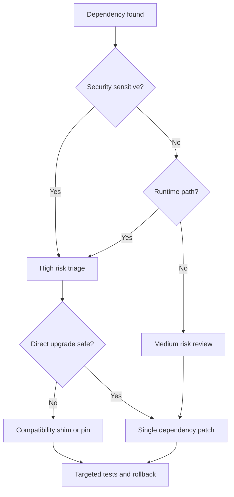

## Summary

This is the first dependency risk matrix generated from the local `rancher-1.6-*` workspace. `latest available version` remains TODO until each dependency is checked against an authoritative registry or upstream release page.

## Risk Rules

- **High**: security-sensitive, runtime-facing, auth/network/database-related, Docker base image, Bower-era UI, or known old framework family.
- **Medium**: build-time or library dependency that may still affect compatibility.
- **Low**: only after a maintainer proves it is isolated and covered by tests.

## Dependency Matrix

| Name | Ecosystem | Repo / path | Current version | Latest available | Risk | EOL | Security sensitive | Direct upgrade | Compatibility shim | Verification |
| --- | --- | --- | --- | --- | --- | --- | --- | --- | --- | --- |
| ubuntu | docker | rancher-1.6-agent / package/Dockerfile | 26.04 | TODO query upstream | high | possible | review | no | likely | targeted build + regression test |
| io.cattle:cattle-framework-utils | maven | rancher-1.6-cattle / code/framework/api/pom.xml | managed/TODO | TODO query upstream | medium | unknown | review | no | likely | targeted build + regression test |
| io.cattle:cattle-framework-object | maven | rancher-1.6-cattle / code/framework/api/pom.xml | managed/TODO | TODO query upstream | medium | unknown | review | no | likely | targeted build + regression test |
| io.cattle:cattle-framework-metrics | maven | rancher-1.6-cattle / code/framework/api/pom.xml | managed/TODO | TODO query upstream | medium | unknown | review | no | likely | targeted build + regression test |
| io.cattle:cattle-framework-events | maven | rancher-1.6-cattle / code/framework/api/pom.xml | managed/TODO | TODO query upstream | medium | unknown | review | no | likely | targeted build + regression test |
| org.apache.commons:commons-beanutils2 | maven | rancher-1.6-cattle / code/framework/api/pom.xml | managed/TODO | TODO query upstream | high | possible | review | no | likely | targeted build + regression test |
| org.apache.commons:commons-collections4 | maven | rancher-1.6-cattle / code/framework/api/pom.xml | managed/TODO | TODO query upstream | high | possible | review | no | likely | targeted build + regression test |
| io.cattle:cattle-framework-spring-module | maven | rancher-1.6-cattle / code/framework/api/pom.xml | managed/TODO | TODO query upstream | high | possible | yes | no | likely | targeted build + regression test |
| jakarta.servlet:jakarta.servlet-api | maven | rancher-1.6-cattle / code/framework/api/pom.xml | managed/TODO | TODO query upstream | medium | unknown | review | no | likely | targeted build + regression test |
| io.cattle:cattle-framework-jooq | maven | rancher-1.6-cattle / code/framework/api/pom.xml | managed/TODO | TODO query upstream | high | possible | review | no | likely | targeted build + regression test |
| io.cattle:cattle-framework-api | maven | rancher-1.6-cattle / code/framework/api-pub-sub/pom.xml | managed/TODO | TODO query upstream | medium | unknown | review | no | likely | targeted build + regression test |
| io.cattle:cattle-iaas-events | maven | rancher-1.6-cattle / code/framework/api-pub-sub/pom.xml | managed/TODO | TODO query upstream | medium | unknown | review | no | likely | targeted build + regression test |
| org.apache.geronimo.specs:geronimo-servlet_3.0_spec | maven | rancher-1.6-cattle / code/framework/api-pub-sub/pom.xml | managed/TODO | TODO query upstream | medium | unknown | review | no | likely | targeted build + regression test |
| io.cattle:cattle-framework-api-pub-sub | maven | rancher-1.6-cattle / code/framework/api-pub-sub-jetty/pom.xml | managed/TODO | TODO query upstream | medium | unknown | review | no | likely | targeted build + regression test |
| org.eclipse.jetty.ee10.websocket:jetty-ee10-websocket-jetty-server | maven | rancher-1.6-cattle / code/framework/api-pub-sub-jetty/pom.xml | managed/TODO | TODO query upstream | high | possible | yes | no | likely | targeted build + regression test |
| jakarta.servlet:jakarta.servlet-api | maven | rancher-1.6-cattle / code/framework/api-pub-sub-jetty/pom.xml | managed/TODO | TODO query upstream | medium | unknown | review | no | likely | targeted build + regression test |
| com.netflix.archaius:archaius-core | maven | rancher-1.6-cattle / code/framework/archaius/pom.xml | managed/TODO | TODO query upstream | medium | unknown | yes | no | likely | targeted build + regression test |
| com.google.guava:guava | maven | rancher-1.6-cattle / code/framework/async/pom.xml | managed/TODO | TODO query upstream | medium | unknown | review | no | likely | targeted build + regression test |
| io.cattle:cattle-framework-utils | maven | rancher-1.6-cattle / code/framework/async/pom.xml | managed/TODO | TODO query upstream | medium | unknown | review | no | likely | targeted build + regression test |
| io.cattle:cattle-framework-managed-context | maven | rancher-1.6-cattle / code/framework/async/pom.xml | managed/TODO | TODO query upstream | medium | unknown | review | no | likely | targeted build + regression test |
| io.cattle:cattle-framework-jooq | maven | rancher-1.6-cattle / code/framework/auditing/pom.xml | managed/TODO | TODO query upstream | high | possible | review | no | likely | targeted build + regression test |
| tianon/true | docker | rancher-1.6-compose-executor / tests/integration/cattletest/core/assets/build/subdir/Dockerfile | latest/TODO | TODO query upstream | high | possible | review | no | likely | targeted build + regression test |
| ubuntu | docker | rancher-1.6-healthcheck / package/Dockerfile | 26.04 | TODO query upstream | high | possible | review | no | likely | targeted build + regression test |
| ubuntu | docker | rancher-1.6-lb-controller / package/haproxy/Dockerfile | 26.04 | TODO query upstream | high | possible | review | no | likely | targeted build + regression test |
| ubuntu | docker | rancher-1.6-lb-controller / package/haproxy/Dockerfile | 26.04 | TODO query upstream | high | possible | review | no | likely | targeted build + regression test |
| rancher/agent-base | docker | rancher-1.6-lb-controller / package/rancher/Dockerfile | v0.3.0 | TODO query upstream | high | possible | review | no | likely | targeted build + regression test |
| ubuntu | docker | rancher-1.6-plugin-manager / package/Dockerfile | 26.04 | TODO query upstream | high | possible | review | no | likely | targeted build + regression test |
| ghcr.io/chen21019/rc16-agent-base | docker | rancher-1.6-rancher / agent/Dockerfile | v0.3.1 | TODO query upstream | high | possible | review | no | likely | targeted build + regression test |
| ubuntu | docker | rancher-1.6-rancher / agent-base/Dockerfile | 26.04 | TODO query upstream | high | possible | review | no | likely | targeted build + regression test |
| ubuntu | docker | rancher-1.6-rancher / agent-base/Dockerfile | 26.04 | TODO query upstream | high | possible | review | no | likely | targeted build + regression test |
| microsoft/nanoserver | docker | rancher-1.6-rancher / agent-windows/Dockerfile | 10.0.14393.1593 | TODO query upstream | high | possible | review | no | likely | targeted build + regression test |
| ubuntu | docker | rancher-1.6-rancher / Dockerfile | 26.04 | TODO query upstream | high | possible | review | no | likely | targeted build + regression test |
| ubuntu | docker | rancher-1.6-rancher / server/Dockerfile | 26.04 | TODO query upstream | high | possible | review | no | likely | targeted build + regression test |
| rancher/dind | docker | rancher-1.6-rancher-catalog / Dockerfile | v0.6.0 | TODO query upstream | high | possible | review | no | likely | targeted build + regression test |
| ubuntu | docker | rancher-1.6-rancher-dns / package/linux/amd64/Dockerfile | 26.04 | TODO query upstream | high | possible | review | no | likely | targeted build + regression test |
| microsoft/nanoserver | docker | rancher-1.6-rancher-dns / package/windows/amd64/Dockerfile | latest/TODO | TODO query upstream | high | possible | review | no | likely | targeted build + regression test |
| ubuntu | docker | rancher-1.6-rancher-metadata / package/Dockerfile | 26.04 | TODO query upstream | high | possible | review | no | likely | targeted build + regression test |
| ubuntu | docker | rancher-1.6-rancher-net / package/Dockerfile | 26.04 | TODO query upstream | high | possible | review | no | likely | targeted build + regression test |
| ubuntu | docker | rancher-1.6-scheduler / package/Dockerfile | 26.04 | TODO query upstream | high | possible | review | no | likely | targeted build + regression test |
| ubuntu | docker | rancher-1.6-storage / package/abs/Dockerfile | 26.04 | TODO query upstream | high | possible | review | no | likely | targeted build + regression test |
| ubuntu | docker | rancher-1.6-storage / package/ebs/Dockerfile | 26.04 | TODO query upstream | high | possible | review | no | likely | targeted build + regression test |
| ubuntu | docker | rancher-1.6-storage / package/efs/Dockerfile | 26.04 | TODO query upstream | high | possible | review | no | likely | targeted build + regression test |
| ubuntu | docker | rancher-1.6-storage / package/example/Dockerfile | 16.04 | TODO query upstream | high | possible | review | no | likely | targeted build + regression test |
| ubuntu | docker | rancher-1.6-storage / package/longhorn/Dockerfile | 16.04 | TODO query upstream | high | possible | review | no | likely | targeted build + regression test |
| ubuntu | docker | rancher-1.6-storage / package/nfs/Dockerfile | 26.04 | TODO query upstream | high | possible | review | no | likely | targeted build + regression test |
| ceph/base | docker | rancher-1.6-storage / package/rbd/Dockerfile | tag-build-master-jewel-ubuntu-16.04 | TODO query upstream | high | possible | review | no | likely | targeted build + regression test |
| ubuntu | docker | rancher-1.6-storage / package/secrets/Dockerfile | 16.04 | TODO query upstream | high | possible | review | no | likely | targeted build + regression test |
| ubuntu | docker | rancher-1.6-storage / package/secrets-bridge-v2/Dockerfile | 16.04 | TODO query upstream | high | possible | review | no | likely | targeted build + regression test |

## Human Maintainer Checklist

- Verify each TODO latest version from Maven Central, npm, Go module proxy, Docker Hub, or official upstream release pages.
- Never upgrade multiple high-risk dependencies in one patch unless the change is a dedicated migration branch.
- Require rollback evidence for server, agent, database, and Docker image changes.

## AI Agent Checklist

- Treat this matrix as inventory, not permission to upgrade.
- Before editing, answer whether API compatibility, DB schema, Docker image, old agents, or catalog behavior can be affected.
- Add verification evidence next to any dependency entry you update.

## Verification Commands Placeholder

```powershell
rg --files ..\rancher-1.6-* -g pom.xml -g package.json -g bower.json -g go.mod -g glide.yaml -g Dockerfile
npm run search:smoke
```

## Risks

Rancher 1.6 is legacy/EOL. A dependency may be vulnerable but still impossible to directly upgrade without breaking old API behavior, old agents, old Docker images, or database migrations.

## Next Reading

- [Dependency Upgrade Runbook](/runbooks/dependency-upgrade/)
- [Known EOL Risks](/security/known-eol-risks/)
- [Patch Workflow](/maintenance/patch-workflow/)

## Diagram



圖名：Dependency upgrade decision tree
用途：避免把所有老 dependency 都視為可直接升級。
AI 用途：AI Agent 必須先判定風險與 compatibility shim，再提出修改。
維護注意：風險規則改變時，要同步更新此圖與表格欄位。
