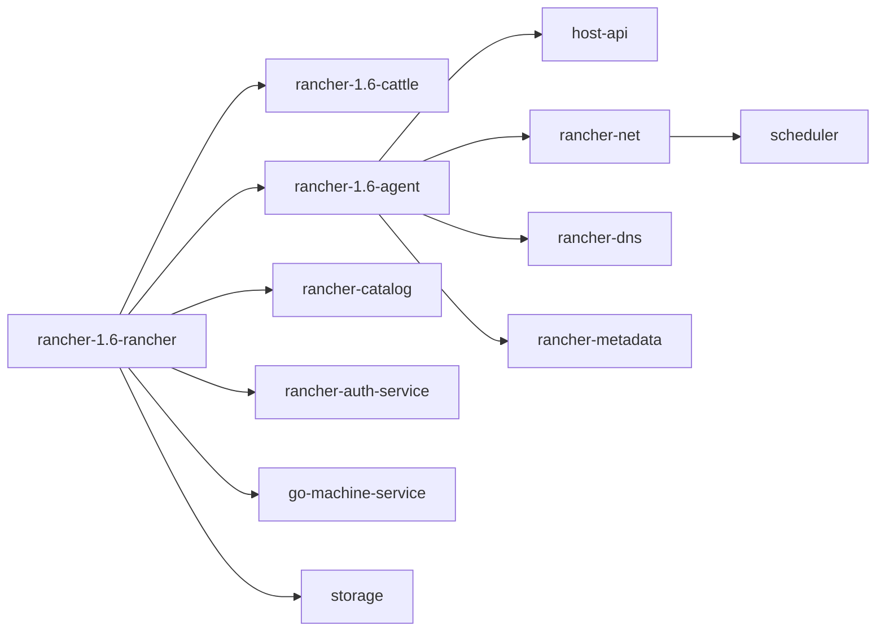

## Summary

The workspace scan found **18** `rancher-1.6-*` repositories under `C:/Users/chen2/Documents/github`. This map is an initial inventory for maintainers and AI agents; it must be refreshed after pulling new forks or changing branches.

## Repository Inventory

| Repository | Build files | Test path count | CI hints | License hints |
| --- | --- | ---: | --- | --- |
| rancher-1.6-agent | Makefile<br>package/Dockerfile<br>service/hostapi/Godeps/Godeps.json | 139 | Not found | LICENSE |
| rancher-1.6-cattle | code/framework/api/pom.xml<br>code/framework/api-pub-sub/pom.xml<br>code/framework/api-pub-sub-jetty/pom.xml<br>code/framework/archaius/pom.xml | 210 | Not found | code/framework/managed-context/LICENSE<br>code/framework/module/LICENSE |
| rancher-1.6-compose-executor | Makefile<br>tests/integration/cattletest/core/assets/build/subdir/Dockerfile<br>tests/integration/cattletest/core/assets/cyclic-link-dependency/docker-compose.yml<br>tests/integration/cattletest/core/assets/env-file/docker-compose.yml | 63 | Not found | LICENSE |
| rancher-1.6-go-machine-service | Makefile | 10 | Not found | LICENSE |
| rancher-1.6-healthcheck | Makefile<br>package/Dockerfile | 1 | Not found | LICENSE |
| rancher-1.6-host-api | Godeps/Godeps.json<br>Makefile | 12 | Not found | LICENSE |
| rancher-1.6-lb-controller | Makefile<br>package/haproxy/Dockerfile<br>package/rancher/Dockerfile | 45 | Not found | LICENSE |
| rancher-1.6-plugin-manager | Makefile<br>package/Dockerfile | 5 | Not found | LICENSE |
| rancher-1.6-rancher | agent/Dockerfile<br>agent-base/Dockerfile<br>agent-windows/Dockerfile<br>Dockerfile | 9 | Not found | LICENSE |
| rancher-1.6-rancher-auth-service | Makefile | 1 | Not found | LICENSE |
| rancher-1.6-rancher-catalog | Dockerfile<br>infra-templates/container-crontab/0/docker-compose.yml<br>infra-templates/container-crontab/1/docker-compose.yml<br>infra-templates/container-crontab/2/docker-compose.yml | 2 | Not found | Check upstream |
| rancher-1.6-rancher-cni-ipam | Makefile | 1 | Not found | LICENSE |
| rancher-1.6-rancher-dns | Makefile<br>package/linux/amd64/Dockerfile<br>package/windows/amd64/Dockerfile | 11 | Not found | cache/LICENSE<br>LICENSE |
| rancher-1.6-rancher-metadata | Makefile<br>package/Dockerfile | 1 | Not found | LICENSE |
| rancher-1.6-rancher-net | Makefile<br>package/Dockerfile | 9 | Not found | LICENSE |
| rancher-1.6-scheduler | Makefile<br>package/Dockerfile | 5 | Not found | LICENSE |
| rancher-1.6-share-mnt | Makefile | 1 | Not found | LICENSE |
| rancher-1.6-storage | Makefile<br>package/abs/Dockerfile<br>package/ebs/Dockerfile<br>package/efs/Dockerfile | 1 | Not found | LICENSE |

## Main Modules

- `rancher-1.6-rancher`: server packaging, launch scripts, docs, and Cattle integration.
- `rancher-1.6-cattle`: Java platform framework, API, DB access, service discovery, and process engine.
- `rancher-1.6-agent`, `host-api`, `metadata`, `dns`, `net`, `scheduler`: runtime services that keep hosts, networking, metadata, and scheduling coherent.
- `rancher-1.6-rancher-catalog`, `compose-executor`, `storage`, `go-machine-service`, `rancher-auth-service`: supporting catalogs, orchestration, storage, provisioning, and auth surfaces.

## Human Maintainer Checklist

- Pull every related fork before making cross-repo conclusions.
- Record branch names and release tags for the exact evidence you used.
- Treat missing CI or license hints as follow-up work, not proof of absence.

## AI Agent Checklist

- Inspect this map and `dependency-map/risk-matrix` before changing code.
- Do not assume one repo owns a behavior until searching sibling repos.
- Include repo/path evidence in final output.

## Verification Commands Placeholder

```powershell
Get-ChildItem .. -Directory -Filter 'rancher-1.6-*'
rg --files ..\rancher-1.6-* -g pom.xml -g package.json -g go.mod -g Dockerfile -g Makefile
npm run search:rebuild
```

## Risks

- The GitHub repositories are maintenance mirrors, not necessarily formal GitHub forks.
- Some repos use historical build systems such as Bower, Glide, old Maven plugins, or legacy Docker base images.
- Cross-repo behavior may depend on tags rather than current default branch state.

## Next Reading

- [Dependency Map](/dependency-map/)
- [Risk Matrix](/dependency-map/risk-matrix/)
- [Patch Workflow](/maintenance/patch-workflow/)

## Diagram



圖名：Rancher 1.6 repository relationship map
用途：協助維護者理解多 repo 關聯，不把 server repo 誤當成唯一來源。
AI 用途：AI Agent 在修改前可用此圖定位可能受影響的 sibling repo。
維護注意：新增 fork、改名或移除 repo 時，必須重跑 inventory 並更新此圖。
