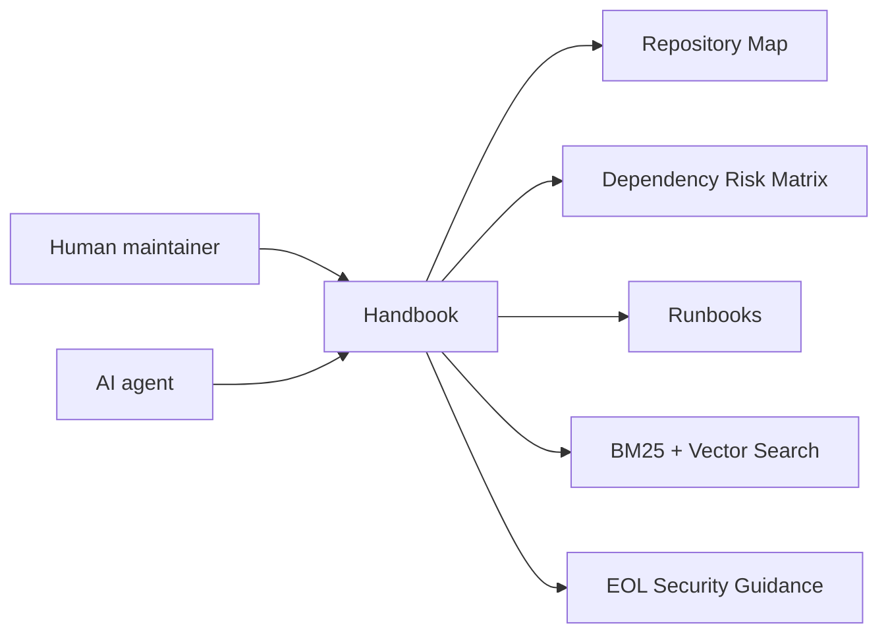

  

    
    
    
    
Cattle-chan: a sakura maintenance heroine guarding Rancher 1.6 builds, dependencies, and release checks.

  

  

    
Sakura Ops Heroine

    
Rancher 1.6 Legacy Maintenance Handbook

    
A multilingual, AI-readable Rancher 1.6 maintenance handbook. The sakura-inspired visual system keeps the site approachable while warnings, commands, and risk guidance stay high-contrast and easy to scan.

    

      <a href="/en/getting-started/for-human-maintainers/">Start Learning</a>
      <a href="/en/ai-guide/">AI Maintenance Guide</a>
      <a href="/en/dependency-map/">Dependency Map</a>
      <a href="/en/search/">Search Docs</a>
    

  

## Quick Entrances

  
New<strong>I am new to Rancher 1.6</strong> Start with the learning path, repo map, and first build.

  
Build<strong>I am fixing a build</strong> Use the build failure runbook and preserve environment evidence.

  
Deps<strong>I am upgrading dependencies</strong> Read the risk matrix before changing versions.

  
CVE<strong>I am reviewing security risk</strong> Start with EOL risks, threat models, and patch process.

  
AI<strong>I am an AI Agent</strong> Read AGENTS.md, the repo map, and safe editing rules first.

  
RC<strong>I am preparing a release</strong> Follow release checklist, verification, and rollback evidence.

## Search Entrance

  
Find the right document before touching code

  <input id="home-doc-search-en" name="home-doc-search-en" aria-label="Search docs" placeholder="Search errors, dependencies, API behavior, runbooks, or AI tasks" />
  

    Build failure
    Dependency upgrade
    CVE triage
    Agent compatibility
    API behavior
    Release checklist
  

## Status Cards

  
Build<strong>Evidence first</strong> CI should publish verified artifacts.

  
Runtime<strong>Java / Go / Node</strong> Repo-specific version matrix still needs owner review.

  
Images<strong>Docker status</strong> Base image risk must be tracked before release.

  
EOL<strong>Known risk</strong> This card must remain visible to avoid false confidence.

  
Deps<strong>Risk matrix</strong> Initial inventory was generated from local repos.

## Maintenance Roadmap

  
<strong>Phase 1: Inventory</strong> Repos, dependencies, and build files.

  
<strong>Phase 2: Reproducible build</strong> Pinned commands and artifacts.

  
<strong>Phase 3: Security triage</strong> CVE scope and mitigation.

  
<strong>Phase 4: Dependency modernization</strong> Small patches and compatibility shims.

  
<strong>Phase 5: Compatibility testing</strong> Server, agent, API, DB, and Docker checks.

  
<strong>Phase 6: Release process</strong> Release notes, rollback, and docs artifacts.

## Diagram

圖名：Handbook first-viewport journey
Purpose: Connect new maintainers, AI agents, the repo map, runbooks, search, and security guidance.
AI use: AI agents can use the homepage entrances to decide which document family to read first.
Maintenance note: update this diagram whenever homepage entrances or roadmap phases change.
