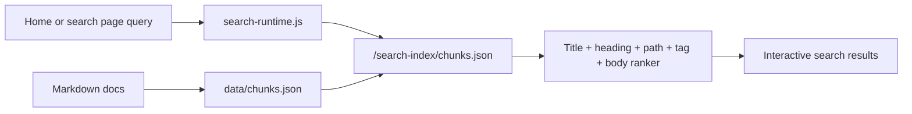

## Document Search

<form class="handbook-search search-panel" data-handbook-search data-search-mode="inline" data-search-locale="en">
  
Live index search

  <input id="docs-search-en" name="q" type="search" aria-label="Search document index" placeholder="Search a repo, error, dependency, API, runbook, or AI task" />
  <button class="search-submit" type="submit">Search</button>
  

  

    <button class="search-chip" type="button" data-search-query="rancher-1.6-cattle pom.xml">Cattle Maven</button>
    <button class="search-chip" type="button" data-search-query="rancher-1.6-agent host-api">Agent / Host API</button>
    <button class="search-chip" type="button" data-search-query="Dockerfile ubuntu image">Docker image</button>
    <button class="search-chip" type="button" data-search-query="dependency upgrade rollback">Dependency upgrade</button>
    <button class="search-chip" type="button" data-search-query="AI Agent safe editing">AI safe editing</button>
  

  

</form>

## Search Scope

This page uses the browser index emitted from `data/chunks.json` into `docs-site/public/search-index/chunks.json`. It searches Traditional Chinese and English docs, the repository map, risk matrix, runbooks, AI agent contracts, and site maintenance pages.

## Human Maintainer Checklist

- Run `npm run search:rebuild` after editing docs so `data/chunks.json` and the public browser index stay synchronized.
- If a page is missing from results, check frontmatter, title, `##` headings, and `search_priority`.
- Important runbooks, risk matrices, and repository maps should use `search_priority: high`.
- Search results are navigation help, not a substitute for repo-specific build/test evidence.

## AI Agent Contract

- Use search to locate candidate pages, then read the full page rather than relying on snippets.
- For dependency or security hits, cross-read [Risk Matrix](/en/dependency-map/risk-matrix/) and [Dependency Upgrade Runbook](/en/runbooks/dependency-upgrade/).
- For repo hits, return to the [Repository Map](/en/getting-started/repository-map/) and check sibling repo impact.

## Diagram

圖名：Browser-side document search flow
Purpose: Explain how the homepage and search page share one chunk index.
AI use: AI agents can find documents first, then read the full maintenance rule.
Maintenance note: update this page and `search-runtime.js` if the ranker, chunk schema, or public index path changes.
