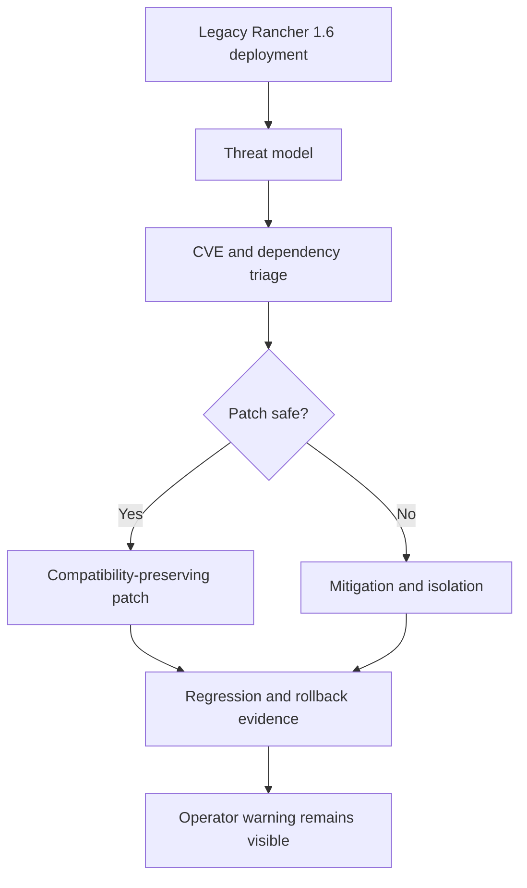

## Position

Rancher 1.6 is legacy/EOL software. This handbook must never present it as a modern supported security platform. The maintenance goal is risk reduction, containment, reproducible builds, and controlled compatibility, not a guarantee of complete safety.

## Production Warning

Production use should be treated as exceptional and isolated. Operators should prefer migration to supported platforms where possible. If legacy operation is unavoidable, use network segmentation, least privilege, backup/restore rehearsals, monitoring, restricted admin access, and strict image provenance.

## Known Risk Families

- Old Docker behavior and daemon API assumptions.
- Old Kubernetes/Cattle orchestration behavior.
- Legacy Java, Maven, Jetty, Spring, Jackson, JOOQ, Liquibase, MySQL/MariaDB, and logging dependencies.
- Legacy Node, Bower, Ember, and UI build tools.
- Old Go dependency management and vendored code.
- Catalog templates and external services that may reference old images.
- Auth, secrets, metadata, websocket proxy, and region communication paths.

## Support Scope

Supported: documentation, reproducible builds, compatibility-preserving patches, CVE triage, isolation guidance, and rollback plans.

Not supported: claims of full modern security, silent major upgrades, disabling security checks, or compatibility-breaking rewrites without explicit migration plans.

## Threat Model Requirements

Every security patch should identify asset, trust boundary, attacker capability, exploitability, affected repo/path, verification, rollback, and operator mitigation.

## Human Maintainer Checklist

- Keep the EOL warning visible in security and release materials.
- Prefer isolation and least privilege even after applying patches.
- Document unsupported scenarios and production caveats.

## AI Agent Checklist

- Do not remove or soften EOL warnings for aesthetics.
- Do not mark CVE risk as solved just because a build passes.
- Provide mitigation when direct upgrade is unsafe.

## Verification Commands Placeholder

```powershell
rg -n "EOL|legacy|CVE|security|threat" docs-site/src/content/docs
npm run search:smoke
```

## Risks

The largest risk is false confidence. A narrow patch may reduce one known issue while the platform remains old and exposed to other classes of vulnerabilities.

## Next Reading

- [Threat Model](/security/threat-model/)
- [Dependency Vulnerability Triage](/security/dependency-vulnerability-triage/)
- [Security Patch Process](/security/security-patch-process/)

## Diagram



圖名：Legacy security risk-reduction flow
用途：說明安全維護目標是降低風險而不是宣稱完全安全。
AI 用途：AI Agent 必須同時提供 patch、mitigation、verification 和 rollback。
維護注意：任何 security 文件更新都不可刪除 production warning。
