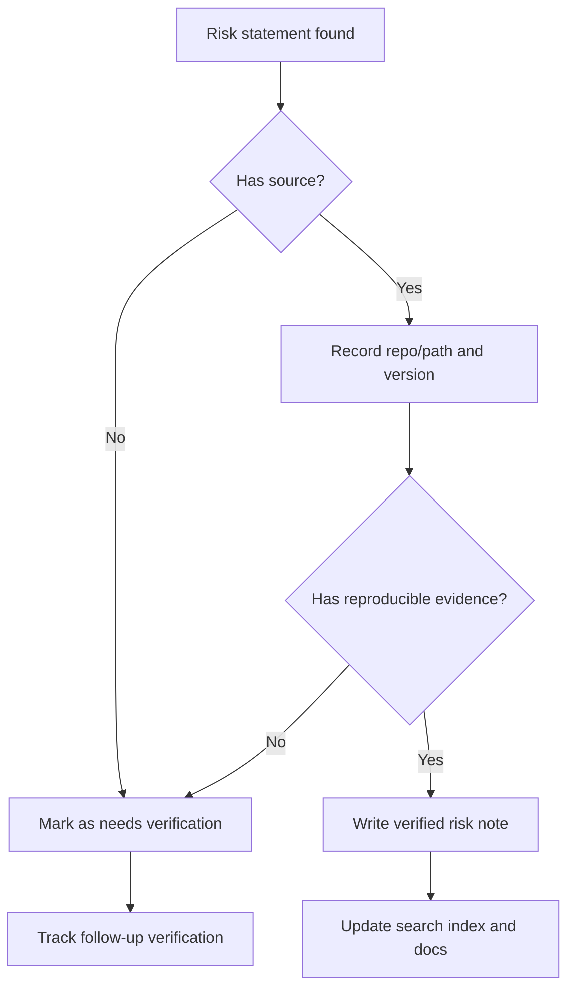

## Usage Rule

This page records source-backed risks and verification tasks only. Content without a source, repo/path, version, tag, or log evidence must stay marked as `needs verification`.

## Verification Table

| Category | Target | Required Evidence | Status |
| --- | --- | --- | --- |
| Dependency | Maven, Go, Node, and Bower packages | package files, lock/vendor data, official registry, or upstream release notes | needs verification |
| Image | Dockerfiles and base image tags | Dockerfile path, registry tag, image digest, or release notes | needs verification |
| API / DB | `rancher-1.6-cattle`, `rancher-1.6-rancher` | endpoint, migration, schema, or test evidence | needs verification |
| Runtime | agent, host-api, network, metadata, DNS | affected path, reproduction steps, logs, and test command | needs verification |
| Catalog | catalog templates, compose fixtures, image tags | template path, operator-facing defaults, and test result | needs verification |

## Writing Rules

- It is acceptable to write `needs verification`, `check the official registry`, or `only local files were inspected`.
- Do not state support status, CVE status, or production risk as a conclusion without a source.
- Any new risk entry must include repo/path, version or tag, verification source, and update date.
- If verification fails, keep the failure reason instead of filling the gap with speculation.

## Human Maintainer Checklist

- Confirm that every risk statement has a traceable source before merging.
- Track dependency, image, API, DB, and agent behavior separately.
- Convert speculation into a verification task.

## AI Agent Contract

- Do not independently assert support status, CVE status, production safety, or unsupported status.
- Do not treat a passing build as a security conclusion.
- Report verification sources; mark missing sources as needs verification.

## Verification Commands

```powershell
rg -n "needs verification|CVE|security|image|registry" docs-site/src/content/docs
npm run search:smoke
```

## Next Reading

- [Threat Model](/en/security/threat-model/)
- [Dependency Vulnerability Triage](/en/security/dependency-vulnerability-triage/)
- [Security Patch Process](/en/security/security-patch-process/)

## Diagram



圖名：Verified risk workflow
用途：Prevents unsupported assumptions from becoming documentation conclusions.
AI 用途：AI Agent must verify sources before changing security or dependency risk content.
維護注意：Update the verification table when new risk categories are added.
