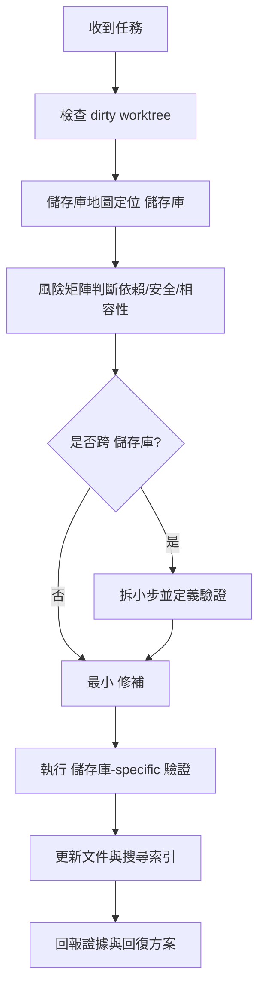

## 先讀這頁再動手

這個工作區不是單一 app，而是 18 個 `rancher-1.6-*` 維護 fork。任何看似小的變更，都可能跨到 `rancher-1.6-rancher`、`rancher-1.6-cattle`、`rancher-1.6-agent`、`rancher-1.6-host-api`、`rancher-1.6-rancher-net`、`rancher-1.6-rancher-dns`、`rancher-1.6-rancher-metadata`、`rancher-1.6-scheduler`、`rancher-1.6-storage` 或 catalog/template 行為。

## AI 工作順序

1. 先執行 `git status --short`，確認使用者是否已有未提交工作。
2. 用 [儲存庫地圖](/getting-started/repository-map/) 定位擁有者 儲存庫，不要只搜目前目錄。
3. 用 [風險矩陣](/dependency-map/risk-matrix/) 判斷 Java、Go、Docker、Node/Bower 或 image 風險。
4. 寫出任務摘要：範圍、受影響 儲存庫、相容性風險、驗證、回復方案。
5. 只做最小 修補；跨 儲存庫 變更要拆成可驗證的小步。
6. 執行最窄驗證，再視風險跑更廣的 build/test。
7. 回報 changed files、tests run、tests not run、known risks、回復方案。

## Repo 選擇速查

| 任務 | 先看 儲存庫 | 常見證據 |
| --- | --- | --- |
| Server packaging / 發版 image | `rancher-1.6-rancher` | `Dockerfile`、`server/Dockerfile`、agent image references |
| API、DB、process engine | `rancher-1.6-cattle` | `pom.xml`、Liquibase、JOOQ、service/process code |
| Host runtime behavior | `rancher-1.6-agent`、`rancher-1.6-host-api` | `Makefile`、Godeps、hostapi tests |
| Networking、DNS、metadata | `rancher-1.6-rancher-net`、`rancher-1.6-rancher-dns`、`rancher-1.6-rancher-metadata` | Dockerfile、Go tests、template labels |
| Scheduling / storage / LB | `rancher-1.6-scheduler`、`rancher-1.6-storage`、`rancher-1.6-lb-controller` | package Dockerfiles、provider-specific tests |
| Catalog/template behavior | `rancher-1.6-rancher-catalog`、`rancher-1.6-compose-executor` | catalog templates、compose fixtures |

## 人類維護者檢查清單

- 審查 AI 任務摘要是否列出 affected 儲存庫s、風險、驗證與回復方案。
- 確認 AI 沒有越界修改 sibling 儲存庫 或移除已查證風險說明。
- 要求 儲存庫-specific 證據；文件站 `npm run verify` 不能取代實際 fork build/test。

## AI Agent 作業契約

- 必須先讀 `AGENTS.md`、本頁、儲存庫地圖與風險矩陣。
- 必須保留使用者既有變更，不可 revert unrelated work。
- 必須在 final answer 回報 changed files、tests run、tests not run、known risks、回復方案。

## 禁止事項

- 不可為了讓 build 過而刪測試、跳過安全檢查或移除已查證風險說明。
- 不可把 `latest` image、major dependency upgrade 或 DB migration 當成低風險修補。
- 不可大規模格式化 18 個 儲存庫；這會掩蓋真正行為差異。
- 不可只更新文件站畫面卻不重建搜尋索引。

## 必跑檢查

```powershell
git status --short
rg --files ..\rancher-1.6-* -g AGENTS.md -g README.md -g Makefile -g pom.xml -g Dockerfile -g package.json -g bower.json -g Godeps.json
npm run search:rebuild
```

## 圖表



圖名：AI Agent Rancher 1.6 維護入口
用途：讓 AI 在改 code 前先定位 儲存庫、風險與驗證。
AI 用途：作為每次任務的自我檢查流程。
維護注意：新增 fork 或改變 儲存庫 ownership 時，必須同步更新表格。
