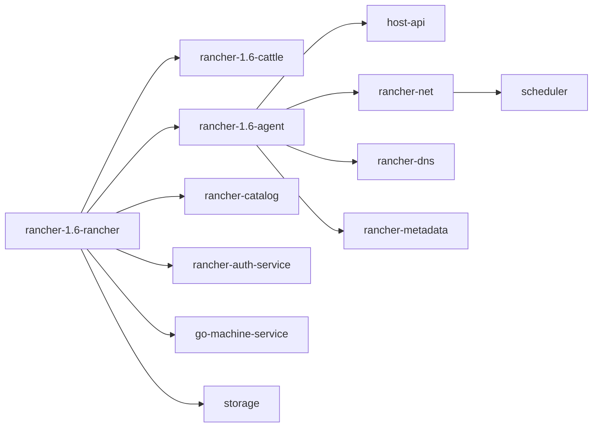

## 掃描摘要

本機工作區在 `C:/Users/chen2/Documents/github` 掃描到 **18** 個 `rancher-1.6-*` 儲存庫。這份地圖是給人類維護者與 AI Agent 使用的初始盤點；只要 拉取新分支、切換分支或改變儲存庫結構，就必須重新整理。

## 儲存庫清單

| 儲存庫 | 建置檔案 | 測試路徑數 | CI 線索 | 授權線索 |
| --- | --- | ---: | --- | --- |
| rancher-1.6-agent | Makefile<br>package/Dockerfile<br>service/hostapi/Godeps/Godeps.json | 139 | 未找到 | LICENSE |
| rancher-1.6-cattle | code/framework/api/pom.xml<br>code/framework/api-pub-sub/pom.xml<br>code/framework/api-pub-sub-jetty/pom.xml<br>code/framework/archaius/pom.xml | 210 | 未找到 | code/framework/managed-context/LICENSE<br>code/framework/module/LICENSE |
| rancher-1.6-compose-executor | Makefile<br>tests/integration/cattletest/core/assets/build/subdir/Dockerfile<br>tests/integration/cattletest/core/assets/cyclic-link-dependency/docker-compose.yml<br>tests/integration/cattletest/core/assets/env-file/docker-compose.yml | 63 | 未找到 | LICENSE |
| rancher-1.6-go-machine-service | Makefile | 10 | 未找到 | LICENSE |
| rancher-1.6-healthcheck | Makefile<br>package/Dockerfile | 1 | 未找到 | LICENSE |
| rancher-1.6-host-api | Godeps/Godeps.json<br>Makefile | 12 | 未找到 | LICENSE |
| rancher-1.6-lb-controller | Makefile<br>package/haproxy/Dockerfile<br>package/rancher/Dockerfile | 45 | 未找到 | LICENSE |
| rancher-1.6-plugin-manager | Makefile<br>package/Dockerfile | 5 | 未找到 | LICENSE |
| rancher-1.6-rancher | agent/Dockerfile<br>agent-base/Dockerfile<br>agent-windows/Dockerfile<br>Dockerfile | 9 | 未找到 | LICENSE |
| rancher-1.6-rancher-auth-service | Makefile | 1 | 未找到 | LICENSE |
| rancher-1.6-rancher-catalog | Dockerfile<br>infra-templates/container-crontab/0/docker-compose.yml<br>infra-templates/container-crontab/1/docker-compose.yml<br>infra-templates/container-crontab/2/docker-compose.yml | 2 | 未找到 | 需查上游 |
| rancher-1.6-rancher-cni-ipam | Makefile | 1 | 未找到 | LICENSE |
| rancher-1.6-rancher-dns | Makefile<br>package/linux/amd64/Dockerfile<br>package/windows/amd64/Dockerfile | 11 | 未找到 | cache/LICENSE<br>LICENSE |
| rancher-1.6-rancher-metadata | Makefile<br>package/Dockerfile | 1 | 未找到 | LICENSE |
| rancher-1.6-rancher-net | Makefile<br>package/Dockerfile | 9 | 未找到 | LICENSE |
| rancher-1.6-scheduler | Makefile<br>package/Dockerfile | 5 | 未找到 | LICENSE |
| rancher-1.6-share-mnt | Makefile | 1 | 未找到 | LICENSE |
| rancher-1.6-storage | Makefile<br>package/abs/Dockerfile<br>package/ebs/Dockerfile<br>package/efs/Dockerfile | 1 | 未找到 | LICENSE |

## 維護模組分組

- **Server / API / DB**：`rancher-1.6-rancher` 負責 server packaging、image chain 與整合入口；`rancher-1.6-cattle` 負責 Java framework、API、DB access、service discovery 與 process engine。
- **Host runtime**：`rancher-1.6-agent` 與 `rancher-1.6-host-api` 負責 host event、Docker socket、logs、stats、exec/proxy 等 runtime 行為。
- **Network plane**：`rancher-1.6-rancher-net`、`rancher-1.6-rancher-dns`、`rancher-1.6-rancher-metadata`、`rancher-1.6-scheduler` 共同影響 service discovery、metadata、DNS 與 scheduling。
- **Supporting services**：`rancher-1.6-rancher-catalog`、`compose-executor`、`storage`、`go-machine-service`、`rancher-auth-service` 影響 catalog、compose execution、storage provider、provisioning 與 auth。

## 編輯前定位規則

- 改 API 或 DB：先搜 `rancher-1.6-cattle`，再確認 `rancher-1.6-rancher` 是否包裝或呼叫該行為。
- 改 host / Docker 行為：先搜 `rancher-1.6-agent` 與 `rancher-1.6-host-api`。
- 改 service discovery：必須同時檢查 metadata、DNS、network、scheduler。
- 改 image tag 或 Dockerfile：回到 [風險矩陣](/dependency-map/risk-matrix/)，不要直接改 base image。
- 改 catalog/template：必須檢查 compose executor fixtures 與 operator-facing defaults。

## 人類維護者檢查清單

- 做跨 儲存庫 結論前，先 pull 所有相關 fork。
- 記錄 branch 名稱、發版 tag 與使用的證據來源。
- CI 或授權線索缺失只能當作後續工作，不能當作不存在的證明。

## AI Agent 檢查清單

- 改 code 前先閱讀本地圖與 `dependency-map/risk-matrix`。
- 搜尋 sibling 儲存庫s 前，不可假設某個行為只由單一 儲存庫 擁有。
- 最終輸出必須包含 儲存庫/path 證據。

## 驗證指令

```powershell
Get-ChildItem .. -Directory -Filter 'rancher-1.6-*'
rg --files ..\rancher-1.6-* -g pom.xml -g package.json -g go.mod -g Dockerfile -g Makefile
npm run search:rebuild
```

## 風險

- 這些 GitHub 儲存庫 是維護鏡像，不一定是 GitHub formal fork。
- 部分 儲存庫 使用 Bower、Glide、舊 Maven plugin 或 舊版 Docker base image 等歷史建置系統。
- 跨 儲存庫 行為可能取決於 tag，而不是目前 default branch 狀態。

## 下一步閱讀

- [依賴地圖](/dependency-map/)
- [風險矩陣](/dependency-map/risk-matrix/)
- [修補工作流程](/maintenance/patch-workflow/)

## 圖表



圖名：Rancher 1.6 儲存庫 關聯圖
用途：協助維護者理解多儲存庫 關聯，不把 server 儲存庫 誤當成唯一來源。
AI 用途：AI Agent 在修改前可用此圖定位可能受影響的 sibling 儲存庫。
維護注意：新增 fork、改名或移除 儲存庫 時，必須重跑 inventory 並更新此圖。
