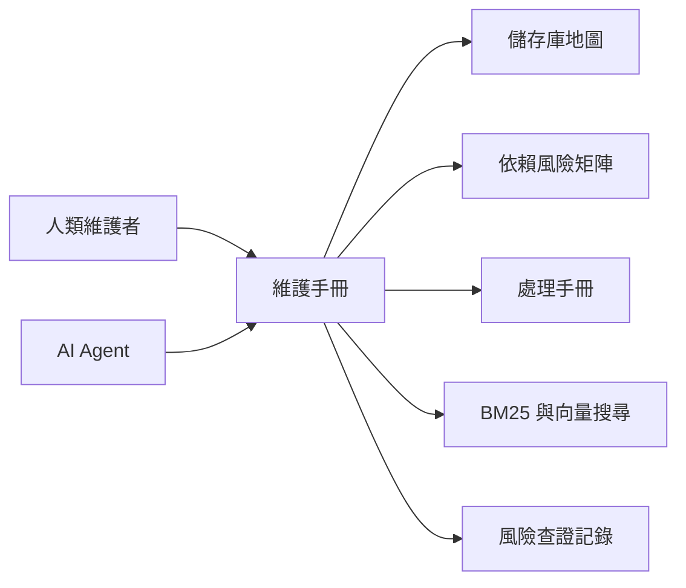

  

    
    
    
    
Cattle-chan：櫻花系維護妹子，負責守住 Rancher 1.6 的建置、依賴與發版檢查。

  

  

    
櫻花維護女主角

    
Rancher 1.6 舊版維護手冊

    
繁體中文、多語系、AI 可讀的 Rancher 1.6 維護手冊。用櫻花系視覺降低閱讀壓力，但所有警告、指令與風險說明都保持高對比、清楚可掃描。

    

      <a href="/getting-started/for-human-maintainers/">開始學習</a>
      <a href="/ai-guide/">AI 維護指南</a>
      <a href="/dependency-map/">依賴地圖</a>
      <a href="/search/">搜尋文件</a>
    

  

## 快速入口

  
新手<strong>第一次維護 Rancher 1.6</strong> 先看學習路徑、儲存庫地圖與第一次建置。

  
建置<strong>正在修建置失敗</strong> 使用建置失敗處理手冊，保留完整環境與錯誤證據。

  
依賴<strong>準備升級依賴</strong> 先讀風險矩陣，不要直接改版本。

  
CVE<strong>檢查安全風險</strong> 從風險查證、威脅模型與修補流程開始。

  
AI<strong>我是 AI Agent</strong> 先讀 AGENTS.md、儲存庫地圖與安全編輯規則。

  
發版<strong>準備發版</strong> 依照發版檢查表補齊文件、驗證與回復方案。

## 搜尋入口

<form class="search-panel handbook-home-search" data-handbook-search data-search-mode="redirect" data-search-locale="zh" action="/search/">
  
先找到文件，再碰程式碼

  <input id="home-doc-search" name="q" type="search" aria-label="搜尋文件" placeholder="搜尋錯誤訊息、依賴、API、處理手冊或 AI 任務" />
  <button class="search-submit" type="submit">搜尋</button>
  

  

    <button class="search-chip" type="button" data-search-query="建置失敗">建置失敗</button>
    <button class="search-chip" type="button" data-search-query="依賴升級">依賴升級</button>
    <button class="search-chip" type="button" data-search-query="CVE 分流">CVE 分流</button>
    <button class="search-chip" type="button" data-search-query="Agent 相容性">Agent 相容性</button>
    <button class="search-chip" type="button" data-search-query="API 行為">API 行為</button>
    <button class="search-chip" type="button" data-search-query="發版檢查">發版檢查</button>
  

</form>

## 狀態卡片

  
建置<strong>證據優先</strong> 等待 CI 發佈已驗證產物。

  
執行<strong>Java / Go / Node</strong> 各儲存庫版本矩陣待補。

  
映像<strong>Docker 狀態</strong> 發版前必須追蹤基礎映像風險。

  
查證<strong>待查風險</strong> 只呈現有來源或明確標為待查證的風險。

  
依賴<strong>風險矩陣</strong> 已由本機掃描產生初版。

## 維護路線圖

  
<strong>階段 1：盤點</strong> 儲存庫、依賴與建置檔。

  
<strong>階段 2：可重現建置</strong> 固定指令與建置產物。

  
<strong>階段 3：安全分流</strong> CVE 影響範圍與緩解。

  
<strong>階段 4：依賴現代化</strong> 小步修補與相容性補丁。

  
<strong>階段 5：相容性測試</strong> Server、agent、API、DB 與 Docker 檢查。

  
<strong>階段 6：發版流程</strong> 發版說明、回復方案與文件產物。

## 圖表

圖名：手冊首頁閱讀路徑
用途：連結新維護者、AI Agent、儲存庫地圖、處理手冊、搜尋與風險查證記錄。
AI 用途：AI Agent 可依首頁入口決定要先讀哪一類文件。
維護注意：首頁快速入口或路線圖改變時，要同步更新此圖。
