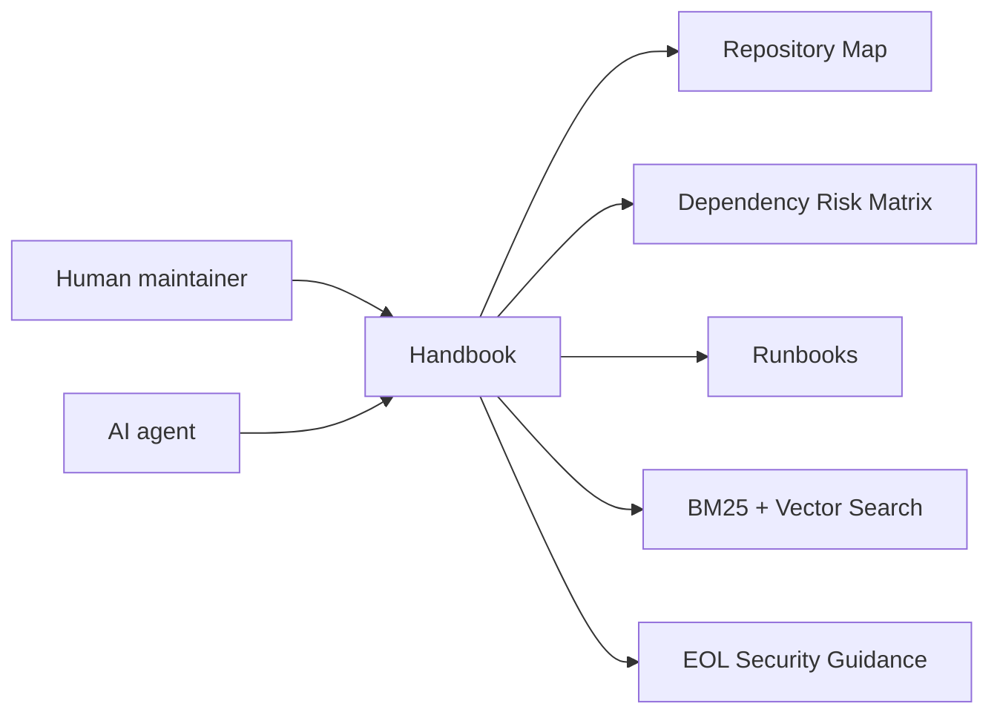

  

    
    
    
    
Cattle-chan：櫻花系維護妹子，負責守住 Rancher 1.6 的 build、依賴與發版檢查。

  

  

    
Sakura Ops Heroine

    
Rancher 1.6 Legacy 維護手冊

    
繁體中文、多語系、AI 可讀的 Rancher 1.6 維護手冊。用櫻花系視覺降低閱讀壓力，但所有警告、指令與風險說明都保持高對比、清楚可掃描。

    

      <a href="/getting-started/for-human-maintainers/">開始學習</a>
      <a href="/ai-guide/">AI 維護指南</a>
      <a href="/dependency-map/">依賴地圖</a>
      <a href="/search/">搜尋文件</a>
    

  

## 快速入口

  
新手<strong>第一次維護 Rancher 1.6</strong> 先看學習路徑、repo map 與第一次 build。

  
Build<strong>正在修建置失敗</strong> 使用 build failure runbook，保留完整環境與錯誤證據。

  
Deps<strong>準備升級依賴</strong> 先讀風險矩陣，不要直接改版本。

  
CVE<strong>檢查安全風險</strong> 從 EOL 風險、威脅模型與修補流程開始。

  
AI<strong>我是 AI Agent</strong> 先讀 AGENTS.md、repo map 與 safe editing rules。

  
RC<strong>準備發版</strong> 依照 release checklist 補齊文件、驗證與 rollback。

## 搜尋入口

  
先找到文件，再碰程式碼

  <input id="home-doc-search" name="home-doc-search" aria-label="搜尋文件" placeholder="搜尋錯誤訊息、dependency、API、runbook 或 AI task" />
  

    建置失敗
    依賴升級
    CVE 分流
    Agent 相容性
    API 行為
    發版檢查
  

## 狀態卡片

  
Build<strong>證據優先</strong> 等待 CI 發佈已驗證 artifact。

  
Runtime<strong>Java / Go / Node</strong> 各 repo 版本矩陣待補。

  
Images<strong>Docker 狀態</strong> 發版前必須追蹤 base image 風險。

  
EOL<strong>已知風險</strong> 這張卡不能移除，避免錯誤安全感。

  
Deps<strong>風險矩陣</strong> 已由本機掃描產生初版。

## 維護路線圖

  
<strong>Phase 1：盤點</strong> Repo、依賴與 build files。

  
<strong>Phase 2：可重現建置</strong> 固定指令與 artifact。

  
<strong>Phase 3：安全分流</strong> CVE 影響範圍與緩解。

  
<strong>Phase 4：依賴現代化</strong> 小步修補與 compatibility shim。

  
<strong>Phase 5：相容性測試</strong> Server、agent、API、DB 與 Docker 檢查。

  
<strong>Phase 6：發版流程</strong> Release notes、rollback 與 docs artifact。

## 圖表

圖名：Handbook first-viewport journey
用途：連結新維護者、AI Agent、repo map、runbook、search 與 security guidance。
AI 用途：AI Agent 可依首頁入口決定要先讀哪一類文件。
維護注意：首頁快速入口或路線圖改變時，要同步更新此圖。
