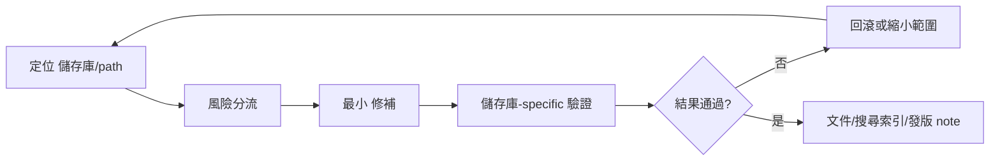

## 流程定位

這份流程適用於 18 個 `rancher-1.6-*` 儲存庫 的維護 修補。它假設系統仍需要保留 Rancher 1.6 的 API、agent、catalog、metadata、DNS、network、storage 與 Docker image 相容性。

## Patch 五階段

| 階段 | 產物 | 不能省略的證據 |
| --- | --- | --- |
| 1. 定位 | affected 儲存庫/path 清單 | `rg` 搜尋結果、build file、測試位置 |
| 2. 分流 | bug / dependency / CVE / build / docs 分類 | 風險矩陣或 處理手冊 連結 |
| 3. 修改 | 最小 修補 | changed files 不含無關格式化 |
| 4. 驗證 | 儲存庫-specific 指令與結果 | 失敗輸出也要保留 |
| 5. 發佈準備 | 發版 note、回復方案、operator warning | 已查證風險說明不可移除 |

## 常見 儲存庫 流程

- `rancher-1.6-cattle`：先鎖定 Maven module、API/DB 影響，再跑該 module 測試或最小 Maven build。
- `rancher-1.6-agent` / `host-api`：先確認 Go package、host event fixture、Docker socket/host stats 行為。
- `rancher-1.6-rancher`：先確認 image build chain、agent-base、Windows/Linux image tag 與 server packaging。
- `rancher-1.6-storage` / `lb-controller` / `dns` / `net`：先確認 package Dockerfile 與 provider-specific 行為。
- `rancher-1.6-rancher-catalog`：先檢查 template version、compose file、image tag 與 operator-facing default。

## 審查檢查清單

- 變更是否只碰必要 儲存庫？
- 是否新增或更新最小測試？
- 是否更新相關文件、Mermaid 圖與搜尋索引？
- 是否列出不能驗證的部分與原因？
- 回復方案 是否包含 image、DB、catalog template 或 operator config？

## 人類維護者檢查清單

- 確認 修補 已完成定位、分流、修改、驗證、發佈準備五階段。
- 對 high-risk dependency、Docker image、DB migration 要求額外審查。
- 發版 note 必須保留 已查證風險與回復方案 caveat。

## AI Agent 作業契約

- 不可略過 儲存庫-specific 驗證說明。
- 不可用 broad formatting 掩蓋 修補。
- 必須回報未測項目與原因。

## 圖表

圖名：Rancher 1.6 修補 workflow
用途：把 修補 從定位到發佈準備串成可審核流程。
AI 用途：AI Agent 的 final answer 必須對應這五階段。
維護注意：新增 CI 或 儲存庫-specific test 後，請更新常見 儲存庫 流程。
