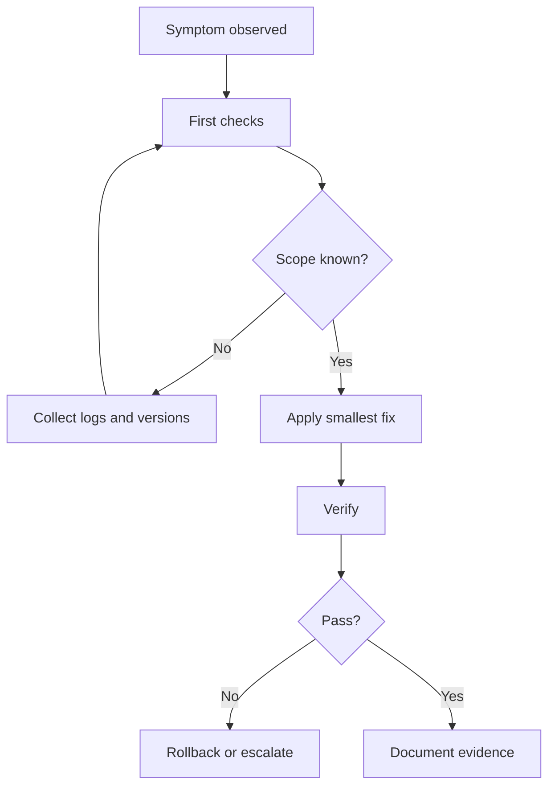

## Symptoms
- Build, runtime, API, or release behavior differs from the expected Rancher 1.6 compatibility contract.

## Scope
- Identify the exact repo, branch, artifact, Docker image, API route, and dependency involved.

## First checks
- Confirm current branch and dirty state.
- Capture exact command, error output, and environment versions.
- Compare with upstream Rancher 1.6 behavior when possible.

## Safe commands
```powershell
git status --short
rg --files -g package.json -g pom.xml -g go.mod -g Dockerfile
npm run search:smoke
```

## Common causes
- EOL dependency behavior changed on modern OS images.
- Java, Go, Node, Docker, or database version mismatch.
- Hidden compatibility contract between server, agent, metadata, and catalog.

## Investigation flow
1. Reproduce the failure with the smallest command.
2. Locate the owning repo and build file.
3. Search dependency and API docs.
4. Patch one variable at a time.
5. Verify legacy compatibility before documenting success.

## Fix strategy
Prefer compatibility shims, pinned versions, narrow patches, and additional tests over broad dependency jumps.

## Verification
```powershell
npm run verify
# plus repo-specific build/test command recorded in the PR
```

## Rollback
Revert the specific patch, restore the previous image or artifact, and note any database or API state that cannot be automatically rolled back.

## AI agent notes
Follow `AGENTS.md`; never mask a real failure with mocks or skipped checks.

## Human maintainer notes
Require reproducible evidence before merging and preserve release notes for operators.


## 人類維護者檢查清單

- Confirm symptoms, scope, and affected repository before editing.
- Capture exact commands, logs, versions, and artifact names.
- Require verification and rollback evidence before closing the runbook.

## AI Agent 檢查清單

- Follow `AGENTS.md` and produce a task summary before changes.
- Use the smallest safe command sequence and avoid unrelated edits.
- Report tests run, tests not run, known risks, and rollback steps.
## 圖表



圖名：Database Migration Error 流程
用途：提供可重複的 troubleshooting decision tree。
AI 用途：AI Agent 必須先做 first checks，再小步修正與驗證。
維護注意：新增常見原因或 rollback 方式時要同步更新此圖。

