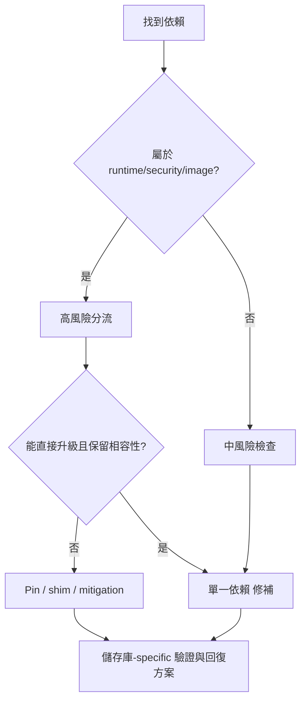

## 先決條件

依賴升級不可直接從「有新版」推導成「應該升級」。Rancher 1.6 fork 同時含 Java/Maven、Go/Godeps、Docker images、Node/Bower、catalog templates 與 Windows/Linux image 差異。每次只升級一個 dependency 或一個明確相依群組。

## Step 1：定位依賴

```powershell
rg --files ..\rancher-1.6-* -g pom.xml -g package.json -g bower.json -g go.mod -g glide.yaml -g Godeps.json -g Dockerfile
rg -n "ubuntu|nanoserver|agent-base|jetty|spring|jackson|guava|bower|ember|Godeps" ..\rancher-1.6-*
```

## Step 2：分風險

| 類型 | 高風險條件 | 必看 儲存庫 |
| --- | --- | --- |
| Maven / Java | API、DB、Jetty、Spring、Jackson、Liquibase、JOOQ | `rancher-1.6-cattle` |
| Go / Godeps | host runtime、network、metadata、DNS、scheduler | `agent`、`host-api`、`net`、`dns`、`metadata`、`scheduler` |
| Docker base image | Ubuntu 16.04、nanoserver、agent-base、dind、Ceph | `rancher`、`storage`、`lb-controller`、`catalog` |
| Node / Bower | UI build、old Ember/Bower assets | `rancher-1.6-rancher` |
| Catalog template | operator-facing default、image tag、compose syntax | `rancher-catalog`、`compose-executor` |

## Step 3：選策略

- **Pin**：registry 行為變動但 舊版 code 不可升級時，固定舊版並文件化風險。
- **Patch**：只修 CVE 或 build break 的最小變更。
- **Compatibility shim**：新 dependency 行為不同，但可以用小 shim 保留舊 API。
- **遷移 branch**：涉及 major framework、DB migration、agent protocol 或 image family 時，不可混入一般 修補。

## Step 4：驗證

每個 PR 至少要包含：

- dependency 前後版本與來源。
- affected 儲存庫/path。
- 儲存庫-specific build/test 指令。
- 不能測的理由。
- 回復方案：版本 pin、image tag、DB migration、catalog template 的還原方式。

```powershell
npm run search:rebuild
npm run verify
```

`npm run verify` 只驗證文件站與搜尋索引，不代表 18 個 分支的 runtime compatibility 已通過。

## 人類維護者檢查清單

- 確認每次只升級一個 dependency 或一個明確相依群組。
- 確認 registry/upstream 來源與目前版本都有證據。
- 對 high-risk 條目要求 回復方案 與 operator mitigation。

## AI Agent 作業契約

- 不可把「有新版」當成升級理由。
- 必須先查 affected 儲存庫/path，再提出 修補。
- 必須列出 direct upgrade、pin、shim、migration branch 之中採用哪一種策略。

## 圖表



圖名：依賴升級決策樹
用途：避免把 舊版 dependency 當成可直接升級。
AI 用途：AI Agent 必須先判斷風險、策略與驗證。
維護注意：風險矩陣欄位或 儲存庫 清單改變時，同步更新本頁。
