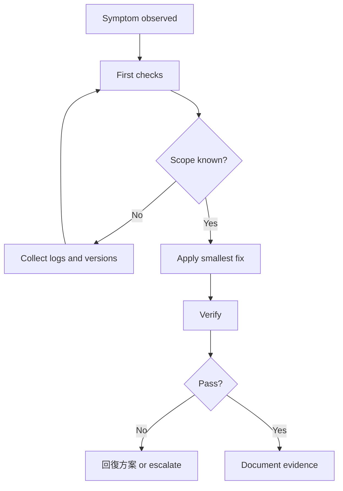

## 症狀
- Build、runtime、API 或 發版 行為與預期的 Rancher 1.6 相容性契約不一致。

## 範圍
- 確認牽涉的 儲存庫、branch、artifact、Docker image、API route 與 dependency。

## 初步檢查
- 確認目前 branch 與 dirty state。
- 保留精確指令、錯誤輸出與環境版本。
- 可行時對照 upstream Rancher 1.6 行為。

## 安全指令
```powershell
git status --short
rg --files -g package.json -g pom.xml -g go.mod -g Dockerfile
npm run search:smoke
```

## 常見原因
- Dependency 或 image 在不同環境上行為改變。
- Java、Go、Node、Docker 或 database 版本不一致。
- server、agent、metadata 與 catalog 之間存在隱含相容性契約。

## 調查流程
1. 用最小指令重現 failure。
2. 定位 owning 儲存庫 與 build file。
3. 搜尋 dependency 與 API 文件。
4. 一次只修一個變因。
5. 記錄成功前，先驗證 舊版 compatibility。

## 修復策略
優先使用 compatibility shim、pinned version、窄範圍 修補 與追加測試，避免大幅 dependency jump。

## 驗證
```powershell
npm run verify
# plus 儲存庫-specific build/test command recorded in the PR
```

## 回滾
回滾特定 修補、恢復前一版 image 或 artifact，並記錄無法自動回滾的 database 或 API state。

## AI Agent 注意事項
遵守 `AGENTS.md`；不可用 mock 或跳過檢查掩蓋真實 failure。

## 人類維護者注意事項
合併前必須要求可重現證據，並為 operators 保留 發版 notes。


## 人類維護者檢查清單

- 編輯前先確認症狀、範圍與受影響 儲存庫。
- 記錄精確指令、log、版本與 artifact 名稱。
- 關閉 處理手冊 前，必須提供驗證與回復方案 證據。

## AI Agent 檢查清單

- Follow `AGENTS.md` and produce a task summary before changes.
- 使用最小安全指令序列，避免無關修改。
- 回報已執行測試、未執行測試、已知風險與回復方案 steps。
## 圖表



圖名：Docker Image Error 流程
用途：提供可重複的 troubleshooting decision tree。
AI 用途：AI Agent 必須先做 first checks，再小步修正與驗證。
維護注意：新增常見原因或 回復方案 方式時要同步更新此圖。
