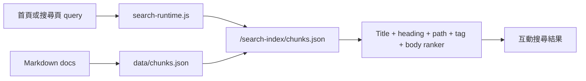

## 文件搜尋

<form class="handbook-search search-panel" data-handbook-search data-search-mode="inline" data-search-locale="zh">
  
真實索引搜尋

  <input id="docs-search" name="q" type="search" aria-label="搜尋文件索引" placeholder="輸入 儲存庫、錯誤訊息、依賴、API、處理手冊 或 AI task" />
  <button class="search-submit" type="submit">搜尋</button>
  

  

    <button class="search-chip" type="button" data-search-query="rancher-1.6-cattle pom.xml">Cattle Maven</button>
    <button class="search-chip" type="button" data-search-query="rancher-1.6-agent host-api">Agent / Host API</button>
    <button class="search-chip" type="button" data-search-query="Dockerfile ubuntu image">Docker image</button>
    <button class="search-chip" type="button" data-search-query="dependency upgrade 回復方案">依賴升級</button>
    <button class="search-chip" type="button" data-search-query="AI Agent safe editing">AI 安全編輯</button>
  

  

</form>

## 搜尋範圍

這個頁面使用 `data/chunks.json` 同步輸出的瀏覽器索引，會搜尋繁體中文與英文文件、儲存庫地圖、風險矩陣、處理手冊、AI agent contract 與站台維護說明。首頁搜尋會導向本頁，本頁則直接在瀏覽器中排序並顯示結果。

## 人類維護者檢查清單

- 修改文件後執行 `npm run search:rebuild`，確保 `data/chunks.json` 與 `docs-site/public/search-index/chunks.json` 同步。
- 若搜尋不到新增頁面，先檢查 frontmatter、標題、`##` heading 與 `search_priority`。
- 重要 處理手冊、風險矩陣與 儲存庫地圖 應使用 `search_priority: high`。
- 搜尋結果是維護輔助，不可取代 儲存庫-specific build/test 證據。

## AI Agent 作業契約

- 先用搜尋定位候選文件，再讀完整頁面，不可只引用 snippet。
- 搜尋到依賴或安全條目時，必須交叉讀 [風險矩陣](/dependency-map/risk-matrix/) 與 [依賴升級處理手冊](/runbooks/dependency-upgrade/)。
- 搜尋到 儲存庫 名稱時，必須回到 [儲存庫地圖](/getting-started/repository-map/) 確認 sibling 儲存庫 影響面。

## 圖表

圖名：瀏覽器端文件搜尋流程
用途：說明首頁與搜尋頁如何使用同一份 chunk index。
AI 用途：AI Agent 可先找文件，再讀完整維護規則。
維護注意：若 ranker、chunk schema 或 public index 路徑改變，必須同步更新本頁與 `search-runtime.js`。
