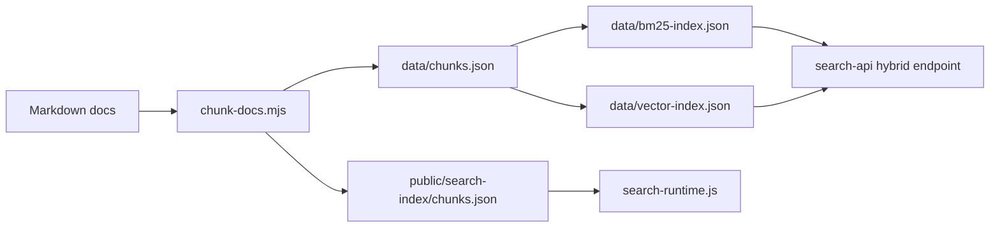

## 架構目標

搜尋要服務兩種工作：人類維護者快速找到 處理手冊，AI Agent 在編輯前定位 儲存庫、風險與安全規則。它不能只是 UI 裝飾，必須由文件內容產生索引。

## 元件

| 元件 | 路徑 | 用途 |
| --- | --- | --- |
| chunker | `tools/search-index/chunk-docs.mjs` | 掃描 `docs-site/src/content/docs`，依 `##` section 產生 chunk。 |
| public index | `docs-site/public/search-index/chunks.json` | 給瀏覽器端 `search-runtime.js` 讀取。 |
| BM25 index | `data/bm25-index.json` | 給 smoke test 與後續搜尋 API 使用。 |
| vector index | `data/vector-index.json` | 目前是 mockable vector corpus，保留 hybrid search 介面。 |
| browser runtime | `docs-site/public/search-runtime.js` | 首頁導向與搜尋頁 inline results。 |
| mock API | `search-api` | 驗證 `/api/search/hybrid` contract。 |

## Ranking 規則

瀏覽器搜尋以 query token 對 title、heading、path、tags、body 加權。`search_priority: high` 的頁面會加權，讓 儲存庫地圖、risk matrix、處理手冊、AI rules 比一般背景頁更容易出現在前面。

## 人類維護者檢查清單

- 搜尋 UI、chunk schema、ranker 或 API 改變時，必須重跑完整 verify。
- 確認搜尋結果能找到 儲存庫地圖、risk matrix、dependency 處理手冊 與 verified risk notes。
- public index 不可缺失，否則首頁搜尋會失效。

## AI Agent 作業契約

- 修改文件後必須重建索引。
- 修改搜尋 runtime 後必須用瀏覽器驗證 `/search/?q=dependency%20upgrade`。
- 不可只更新 `data/chunks.json` 而忘記 public index。

## 重新建索引

```powershell
npm run search:rebuild
```

這個指令會依序執行 chunk、BM25、vector、validate、smoke test。若只改 UI 沒改文件，也可以跑完整 rebuild 以確認 public index 還存在。

## 圖表



圖名：文件站搜尋架構
用途：說明索引如何從 Markdown 產生並供瀏覽器與 API 使用。
AI 用途：AI Agent 修改文件或搜尋功能時，知道要同步哪些 artifact。
維護注意：新增搜尋欄位、ranker 或 API schema 時，必須同步更新本頁。
