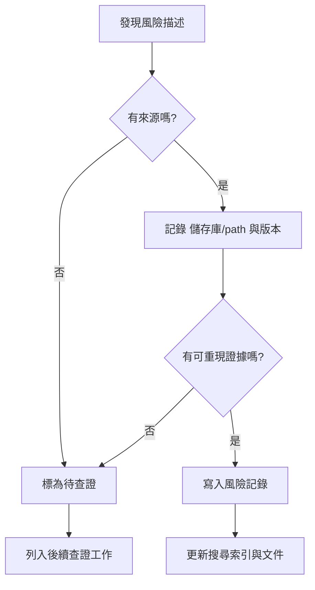

## 使用原則

本頁只放可追溯的風險記錄與待查項目。沒有來源、沒有 儲存庫/path、沒有版本或 log 證據的內容，一律只能標為「待查證」，不能寫成已知事實。

## 查證清單

| 類別 | 查證對象 | 需要的證據 | 狀態 |
| --- | --- | --- | --- |
| 依賴 | Maven、Go、Node、Bower 套件 | package 檔案、lock/vendor 資料、官方 registry 或 upstream 發版 note | 待查證 |
| Image | Dockerfile 與 base image tag | Dockerfile path、registry tag、image digest 或 發版 note | 待查證 |
| API / DB | `rancher-1.6-cattle`、`rancher-1.6-rancher` | endpoint、migration、schema 或測試證據 | 待查證 |
| Runtime | agent、host-api、network、metadata、DNS | 受影響 path、重現步驟、log 與測試指令 | 待查證 |
| Catalog | catalog template、compose fixture、image tag | template path、operator-facing default、測試結果 | 待查證 |

## 寫作規則

- 可以寫「尚未查證」、「需要查官方 registry」、「目前只看到本機檔案」。
- 不可以把支援狀態、CVE 狀態或 production 風險寫成結論，除非附上來源。
- 若要新增風險，必須包含 儲存庫/path、版本或 tag、查證來源與更新日期。
- 若查證失敗，保留失敗原因，不要補上推測文字。

## 人類維護者檢查清單

- 合併前確認每個風險句都有可追溯來源。
- 對 dependency、image、API、DB、agent 行為分開記錄，不要合併成籠統結論。
- 若只是推測，請改成待查證工作項。

## AI Agent 作業契約

- 不可自行宣稱支援狀態、CVE、production safety 或 unsupported 狀態。
- 不可把 build pass 當成安全結論。
- 必須回報查證來源；沒有來源就標成待查證。

## 驗證指令

```powershell
rg -n "待查證|CVE|security|image|registry" docs-site/src/content/docs
npm run search:smoke
```

## 下一步閱讀

- [Threat Model](/security/threat-model/)
- [依賴漏洞分流](/security/dependency-vulnerability-triage/)
- [Security Patch 流程](/security/security-patch-process/)

## 圖表



圖名：風險查證流程
用途：防止把未查證推測寫成文件結論。
AI 用途：AI Agent 必須先查來源，再更新安全或依賴風險內容。
維護注意：新增風險類別時，必須同步更新查證清單。
