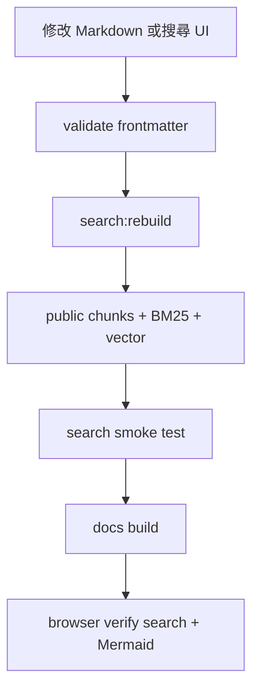

## 何時需要更新

- 新增、刪除或改名任何 Markdown 文件。
- 修改 title、description、tags、`search_priority` 或主要 `##` heading。
- 修改首頁搜尋、搜尋頁、`search-runtime.js` 或 search API contract。
- 更新 儲存庫 inventory、風險矩陣、處理手冊 或 AI agent contract。

## 標準流程

1. 編輯文件。
2. 確認 frontmatter 完整，重要頁面使用 `search_priority: high`。
3. 執行 `npm run search:rebuild`。
4. 執行 `npm run verify`。
5. 用瀏覽器確認 `/search/?q=dependency%20upgrade` 能顯示結果。
6. 若有 Mermaid 圖，確認頁面上有 SVG 而不是原始 code block。

## 產物

| 產物 | 說明 |
| --- | --- |
| `data/chunks.json` | 全站 chunk 來源，供後續索引工具使用。 |
| `docs-site/public/search-index/chunks.json` | 瀏覽器可讀的靜態搜尋索引。 |
| `data/bm25-index.json` | BM25/smoke test 索引。 |
| `data/vector-index.json` | hybrid search 的 vector corpus。 |

## 常見問題

- 搜尋不到頁面：檢查是否重跑 `npm run search:rebuild`。
- 結果排序很低：確認 title、heading、tags 是否含維護者會搜尋的關鍵字。
- 首頁搜尋沒有跳轉：檢查 `<form data-handbook-search data-search-mode="redirect">`。
- 搜尋頁無結果：檢查 `docs-site/public/search-index/chunks.json` 是否存在且可 fetch。

## 人類維護者檢查清單

- 文件變更合併前確認搜尋索引已重建。
- 搜尋頁與首頁搜尋都要手動抽查。
- Mermaid 圖應渲染為 SVG，不應只顯示 code fence。

## AI Agent 作業契約

- 修改文件、frontmatter、搜尋 UI 或 Mermaid wrapper 後必須跑 `npm run verify`。
- 必須回報搜尋索引是否重建成功。
- 若瀏覽器驗證失敗，不能宣稱功能完成。

## 圖表

圖名：搜尋索引維護流程
用途：確保文件、搜尋索引與前端搜尋 UI 同步。
AI 用途：AI Agent 修改文件後不可忘記重建索引。
維護注意：搜尋 pipeline script 改名時，必須同步更新本頁。
